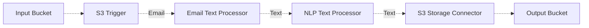

# 📨 E-mail NLP Pipeline

> This example showcases how to parse e-mails and perform an NLP analysis on the content of the e-mail.

## :dna: Pipeline



## ❓ What is Happening

This simple example showcases how to pipe multiple middlewares to perform an NLP analysis on the content of e-mail documents. The pipeline is triggered by an S3 event, which is then consumed by the e-mail text processor.

The e-mail text processor extracts the textual content of the e-mail and pipes it to the NLP analysis using [AWS Comprehend](https://aws.amazon.com/comprehend/) to perform a soft NLP analysis comprising :

- Language detection
- Sentiment analysis
- PII detection
- Statistic analysis

The output of the E-mail and of the NLP analysis is stored in an S3 output bucket.

> 💁 You can modify this example to include other types of NLP analysis such as Named Entity Recognition (NER) or Part-of-Speed (POS) tagging.

## 📝 Requirements

The following requirements are needed to deploy the infrastructure associated with this pipeline:

- You need access to a development AWS account.
- [AWS CDK](https://docs.aws.amazon.com/cdk/latest/guide/getting_started.html#getting_started_install) is required to deploy the infrastructure.
- [Docker](https://docs.docker.com/get-docker/) is required to be running to build middlewares.
- [Node.js](https://nodejs.org/en/download/) v18+ and NPM.
- [Python](https://www.python.org/downloads/) v3.8+ and [Pip](https://pip.pypa.io/en/stable/installation/).

## 🚀 Deploy

Head to the directory [`examples/simple-pipelines/email-nlp-pipeline`](/examples/simple-pipelines/email-nlp-pipeline) in the repository and run the following commands to build the example:

```bash
npm install
npm run build-pkg
```

You can then deploy the example to your account (ensure the AWS CDK is installed and is configured with the appropriate AWS credentials and AWS region):

```bash
npm run deploy
```

## 🧹 Clean up

Don't forget to clean up the resources created by this example by running the following command:

```bash
npm run destroy
```
