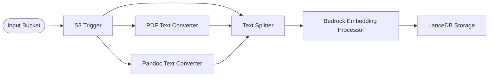

# 💾 Bedrock + LanceDB Pipeline

> In this example, we showcase how to create vector embeddings for text documents (Plain Text, PDF, Office Documents) using the [Amazon Bedrock](https://aws.amazon.com/bedrock/) Titan embedding model. The embeddings are stored within a [LanceDB](https://lancedb.github.io/lancedb/) embedded database that you can query using your own applications.

## :dna: Pipeline



In this pipeline we are generating embeddings for text documents, including plain text files, PDFs, or Microsoft Office documents, and leverage the EFS storage provider with the LanceDB connector to store those generated embeddings into an embedded LanceDB database. The use of EFS makes it a good balance between cost and latency provided for storage and retrieval of documents based on their vector embeddings.

> 💁 It is also possible to use the S3 storage provider with the LanceDB connector to store embeddings on S3 for an even lower cost, but at a much higher latency.

## 📝 Requirements

The following requirements are needed to deploy the infrastructure associated with this pipeline:

- You need access to a development AWS account.
- [AWS CDK](https://docs.aws.amazon.com/cdk/latest/guide/getting_started.html#getting_started_install) is required to deploy the infrastructure.
- [Docker](https://docs.docker.com/get-docker/) is required to be running to build middlewares.
- [Node.js](https://nodejs.org/en/download/) v18+ and NPM.
- [Python](https://www.python.org/downloads/) v3.8+ and [Pip](https://pip.pypa.io/en/stable/installation/).

## 🚀 Deploy

Head to the directory [`examples/simple-pipelines/embedding-pipelines/bedrock-lancedb-pipeline`](/examples/simple-pipelines/embedding-pipelines/bedrock-lancedb-pipeline) in the repository and run the following commands to build the example:

```bash
npm install
npm run build-pkg
```

You can then deploy the example to your account (ensure your AWS CDK is configured with the appropriate AWS credentials and AWS region):

```bash
npm run deploy
```

## 🧹 Clean up

Don't forget to clean up the resources created by this example by running the following command:

```bash
npm run destroy
```
