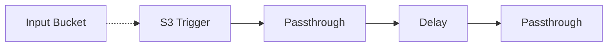

# ⏰ Delay Pipeline

> This example showcases how to insert a delay between two middlewares in a pipeline. This is a technical example for pipeline builders that does not produce any output.

## :dna: Pipeline



## ❓ What is Happening

The `Delay` middleware allows to insert a user-defined delay between 2 middlewares. This can either allow to insert a fixed delay between processing of documents, or resume the processing of a pipeline at a given arbitrary time.

In this example, we showcase how to specify a fixed duration of 30 seconds between passthrough middlewares that only log the document they receive in AWS CloudWatch.

## 📝 Requirements

The following requirements are needed to deploy the infrastructure associated with this pipeline:

- You need access to a development AWS account.
- [AWS CDK](https://docs.aws.amazon.com/cdk/latest/guide/getting_started.html#getting_started_install) is required to deploy the infrastructure.
- [Docker](https://docs.docker.com/get-docker/) is required to be running to build middlewares.
- [Node.js](https://nodejs.org/en/download/) v20+ and NPM.
- [Python](https://www.python.org/downloads/) v3.8+ and [Pip](https://pip.pypa.io/en/stable/installation/).

## 🚀 Deploy

Head to the directory [`examples/simple-pipelines/flow-control-pipelines/delay-pipeline`](/examples/simple-pipelines/flow-control-pipelines/delay-pipeline) in the repository and run the following commands to build the example:

```bash
npm install
npm run build-pkg
```

You can then deploy the example to your account (ensure the AWS CDK is installed and is configured with the appropriate AWS credentials and AWS region):

```bash
npm run deploy
```

## 🧹 Clean up

Don't forget to clean up the resources created by this example by running the following command:

```bash
npm run destroy
```
