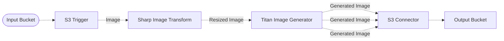

# 🎨 Color Guided Image Pipeline

> In this example, we showcase how to leverage Amazon Bedrock and the Amazon Titan image model capabilities to generate images while guiding the color of the generated image.

## :dna: Pipeline



## ❓ What is Happening

Most designers want to generate images adhering to color branding guidelines so they seek control over color palette in the generated images.

With the [Amazon Titan Image Generator v2](https://aws.amazon.com/fr/blogs/aws/amazon-titan-image-generator-v2-is-now-available-in-amazon-bedrock/), you can generate color-conditioned images based on a color palette—a list of hex colors provided as part of the inputs adhering to color branding guidelines. This example also demonstrates how to provide a reference image as input to generate an image with provided hex colors while inheriting style from the reference image.

Below is an example of the result of the image generation process executed by this example.

<br />
<p align="center">
  <table style="display: table; margin: auto">
    <tr>
      <th>Reference Image</th>
      <th>Prompt</th>
      <th>Color Palette</th>
      <th>Generated Image</th>
    </tr>
    <tr>
      <td style="padding-top: 0.8em; padding-bottom: 1em">
        
      </td>
      <td style="padding-top: 0.8em; padding-bottom: 1em;">
        <em>"a small amazon brown cardboard robot walking on a table"</em>
      </td>
      <td style="padding-top: 0.8em; padding-bottom: 1em;">
        
      </td>
      <td style="padding-top: 0.8em; padding-bottom: 1em">
        
      </td>
    </tr>
  </table>
  <p align="center">Credits to <a href="https://unsplash.com/fr/@helloimnik?utm_content=creditCopyText&utm_medium=referral&utm_source=unsplash">Nik</a> sur <a href="https://unsplash.com/fr/photos/figurine-de-personnage-de-boite-en-carton-amazon-r22qS5ejODs?utm_content=creditCopyText&utm_medium=referral&utm_source=unsplash">Unsplash</a></p>
</p>
<br />

To use this pipeline, simply upload the [reference image](./assets/original.jpg) in this example to the input bucket, and the pipeline will automatically generate a new image matching the color requirements and the reference image, and upload the result to the output bucket. You can of course update the code of the pipeline to customize the color palette and the prompt.

## 📝 Requirements

The following requirements are needed to deploy the infrastructure associated with this pipeline:

- You need access to a development AWS account.
- [AWS CDK](https://docs.aws.amazon.com/cdk/latest/guide/getting_started.html#getting_started_install) is required to deploy the infrastructure.
- [Docker](https://docs.docker.com/get-docker/) is required to be running to build middlewares.
- [Node.js](https://nodejs.org/en/download/) v20+ and NPM.
- [Python](https://www.python.org/downloads/) v3.8+ and [Pip](https://pip.pypa.io/en/stable/installation/).

## 🚀 Deploy

Head to the directory [`examples/simple-pipelines/generative-pipelines/color-guided-image-pipeline`](/examples/simple-pipelines/generative-pipelines/color-guided-image-pipeline) in the repository and run the following commands to build the example:

```bash
npm install
npm run build-pkg
```

You can then deploy the example to your account (ensure your AWS CDK is configured with the appropriate AWS credentials and AWS region):

```bash
npm run deploy
```

## 🧹 Clean up

Don't forget to clean up the resources created by this example by running the following command:

```bash
npm run destroy
```
