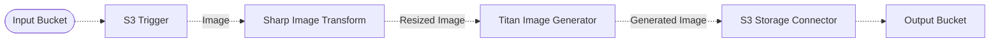

# 🖼️ Image Conditioning Pipeline

> In this example, we showcase how to leverage Amazon Bedrock and the Amazon Titan image model capabilities to perform image conditioning generation based on a canny edge mask.

## :dna: Pipeline



## ❓ What is Happening

You can use the image conditioning feature to shape your creations with precision and intention. By providing a reference image (that is, a conditioning image), you can instruct the model to focus on specific visual characteristics, such as edges, object outlines, and structural elements, or segmentation maps that define distinct regions and objects within the reference image.

In this example, we demonstrate how to generate an image based on a reference image and a prompt.

1. The pipeline is triggered when an image is uploaded to the source S3 bucket. The image is then processed by the `SharpImageTransform` middleware to resize the image to the required dimensions.
2. The resized image is then processed by the `TitanImageGenerator` middleware to generate a new image based on the reference image and the prompt.
3. The pipeline stores the resulting image in the output S3 bucket.

Below is an example of the result of the image generation process executed by this example.

<br />
<p align="center">
  <table>
    <tr>
      <th>Reference Image</th>
      <th>Prompt</th>
      <th>Generated Image</th>
    </tr>
    <tr>
      <td>
        
      </td>
      <td>
        "a tiger as a hand drawn sketch"
      </td>
      <td>
        
      </td>
    </tr>
  </table>
  <p align="center">Credits to <a href="https://unsplash.com/fr/@nickkarvounis?utm_content=creditCopyText&utm_medium=referral&utm_source=unsplash">Nick Karvounis</a> sur <a href="https://unsplash.com/fr/photos/tigre-orange-sur-sol-en-beton-gris--KNNQqX9rqY?utm_content=creditCopyText&utm_medium=referral&utm_source=unsplash">Unsplash</a></p>
</p>
<br />

To use this pipeline, simply upload the [reference image](./assets/original.jpg) in this example to the input bucket, and the pipeline will automatically generate a new image matching the structure of the reference image.

## 📝 Requirements

The following requirements are needed to deploy the infrastructure associated with this pipeline:

- You need access to a development AWS account.
- [AWS CDK](https://docs.aws.amazon.com/cdk/latest/guide/getting_started.html#getting_started_install) is required to deploy the infrastructure.
- [Docker](https://docs.docker.com/get-docker/) is required to be running to build middlewares.
- [Node.js](https://nodejs.org/en/download/) v20+ and NPM.
- [Python](https://www.python.org/downloads/) v3.8+ and [Pip](https://pip.pypa.io/en/stable/installation/).

## 🚀 Deploy

Head to the directory [`examples/simple-pipelines/generative-pipelines/image-conditioning-pipeline`](/examples/simple-pipelines/generative-pipelines/image-conditioning-pipeline) in the repository and run the following commands to build the example:

```bash
npm install
npm run build-pkg
```

You can then deploy the example to your account (ensure your AWS CDK is configured with the appropriate AWS credentials and AWS region):

```bash
npm run deploy
```

## 🧹 Clean up

Don't forget to clean up the resources created by this example by running the following command:

```bash
npm run destroy
```
