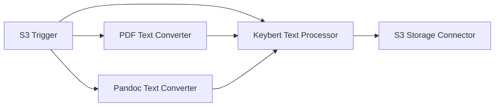

# :blue_book: Graph Visualization Pipeline

> This example showcases how to use the DAG `Renderer` to visualize a Lakechain pipeline.

## :dna: Pipeline



## ❓ What is Happening

In this example, we are laying out a simple topic modeling pipeline for text documents leveraging the Keybert text processor middleware.

We use the `DagRenderer` component to create a visual representation of the pipeline. This can come in handy when building complex pipelines and you want to visualize the pipeline to ensure that it is correct.

```bash
import { DagRenderer, MermaidRenderer } from '@project-lakechain/core/renderer';

// Creating the DAG renderer.
const renderer = new DagRenderer({
  engine: new MermaidRenderer()
});

// Rendering the pipeline with the given middlewares.
renderer.render([
  // List of middlewares.
]);
```

In the stack associated with this example, we use the [Mermaid](https://mermaid-js.github.io/mermaid/#/) rendering engine to render the pipeline into an SVG image that can be seen on the deployment machine. The rendered diagrams look as follow.

<br><br>

<p align="center">
  
</p>
<br><br>

As the goal of this pipeline is less to deploy it, but more to showcase the visualization capabilities of the `DagRenderer`, we will not deploy this pipeline. However, you can synthesize the stack to get a link to the rendered diagram.

The link to the generated diagram is printed to `stderr`, so you can isolate it by running the following command.

```bash
npm run synth 2> output.txt
```

You can then read the content of the `output.txt` file to find the link to the diagram.

<br>
<p align="center">
  
</p>
<br>
