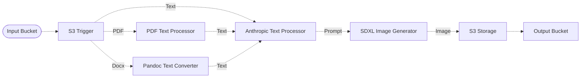

# 🖼️ Image Article Generation

> In this example, we showcase a fun experiment where we're using the Anthropic text model and the SDXL image model hosted on Amazon Bedrock to generate images from input article documents.

## :dna: Pipeline



## ❓ What is Happening

In this example, we are using different middlewares assembled together in a Lakechain pipeline that will generate images from input article documents. Such a pipeline could be integrated in a document processing pipeline to automate the process of generating cover images for articles or other types of text documents.

The flow of this pipeline is as follow.

1. An input document (e.g Plain Text, HTML, Docx or PDF) document is uploaded to the source S3 bucket.
2. The Anthropic text processor generates a prompt based on the input document to generate an image.
3. The SDXL image generator generates an image based on the prompt created by the Anthropic text processor.
4. The generated image is stored in the output S3 bucket.

<br />
<p align="center">
  
  <br>
  <em style="margin-left:auto;margin-right:auto;width:600px;">A document about "Urban Farming" gets converted into an image.</em>
</p>
<br />

## 📝 Requirements

The following requirements are needed to deploy the infrastructure associated with this pipeline:

- You need access to a development AWS account.
- [AWS CDK](https://docs.aws.amazon.com/cdk/latest/guide/getting_started.html#getting_started_install) is required to deploy the infrastructure.
- [Docker](https://docs.docker.com/get-docker/) is required to be running to build middlewares.
- [Node.js](https://nodejs.org/en/download/) v18+ and NPM.
- [Python](https://www.python.org/downloads/) v3.8+ and [Pip](https://pip.pypa.io/en/stable/installation/).

## 🚀 Deploy

Head to the directory [`examples/simple-pipelines/image-article-pipeline`](/examples/simple-pipelines/image-article-pipeline) in the repository and run the following commands to build the example:

```bash
npm install
npm run build-pkg
```

You can then deploy the example to your account (ensure your AWS CDK is configured with the appropriate AWS credentials and AWS region):

```bash
npm run deploy
```

## 🧹 Clean up

Don't forget to clean up the resources created by this example by running the following command:

```bash
npm run destroy
```
