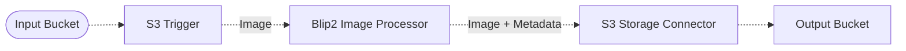

# :camera: Image Captioning Pipeline

> In this example, we use the [BLIP2 image captioning model](https://huggingface.co/docs/transformers/main/model_doc/blip-2) in a Lakechain pipeline to automatically generate captions for images.

## :dna: Pipeline



## ❓ What is Happening

The BLIP-2 model, introduced in the paper [BLIP-2: Bootstrapping Language-Image Pre-training with Frozen Image Encoders and Large Language Models](https://arxiv.org/abs/2301.12597), presents a new approach to vision-language tasks. It allows to generate captions for images using a pre-trained image encoder and a pre-trained language model.

The BLIP-2 Image Processor middleware allows to easily deploy the BLIP-2 model on GPU containers and use it to generate captions for images within a Lakechain document processing pipeline. This is useful if you want to create descriptive labels for your images for later use in search engines, or if you want to generate captions for your images to make them more accessible to visually impaired people.

<br />
<p align="center">
  
</p>
<br />

The BLIP-2 Image Processor middleware will enrich the metadata of the document with the gathered captions and pass them to the next middleware in the pipeline.

> **Note**
> The BLIP2 Image Processor middleware can take a few minutes to execute, as it spawns the BLIP2 model on an ECS cluster using GPU powered instances which can take a few minutes to spin up.

## 📝 Requirements

The following requirements are needed to deploy the infrastructure associated with this pipeline:

- You need access to a development AWS account.
- [AWS CDK](https://docs.aws.amazon.com/cdk/latest/guide/getting_started.html#getting_started_install) is required to deploy the infrastructure.
- [Docker](https://docs.docker.com/get-docker/) is required to be running to build middlewares.
- [Node.js](https://nodejs.org/en/download/) v18+ and NPM.
- [Python](https://www.python.org/downloads/) v3.8+ and [Pip](https://pip.pypa.io/en/stable/installation/).

## 🚀 Deploy

Head to the directory [`examples/simple-pipelines/image-captioning-pipeline`](/examples/simple-pipelines/image-captioning-pipeline) in the repository and run the following commands to build the example:

```bash
npm install
npm run build-pkg
```

You can then deploy the example to your account (ensure your AWS CDK is configured with the appropriate AWS credentials and AWS region):

```bash
npm run deploy
```

## 🧹 Clean up

Don't forget to clean up the resources created by this example by running the following command:

```bash
npm run destroy
```
