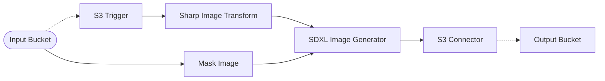
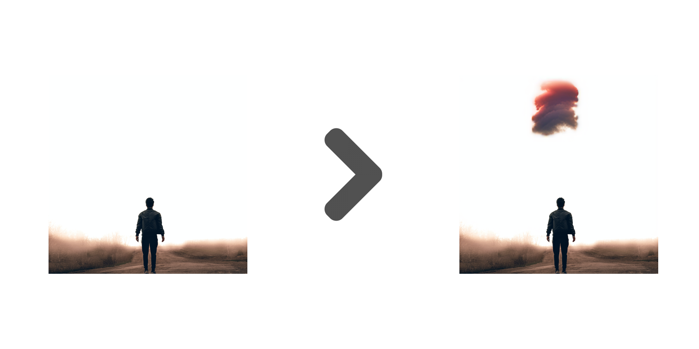

# 🎨 SDXL Inpainting Pipeline

> In this example, we showcase how to leverage Amazon Bedrock and SDXL Generative AI capabilities to perform image inpainting.

## :dna: Pipeline



## ❓ What is Happening

Image inpainting refers to the process of replacing a portion of an image with another image based on a textual prompt. By providing a mask image that outlines the portion to be replaced, a textual prompt, and an image, the Stable Diffusion model can produce a new image that replaces the masked area with the object, subject, or environment described in the textual prompt.

Below is an example of the result of the inpainting process executed by this example, in which we use a [mask image](./assets/mask/mask.png) with the prompt "a glowing red cloud".

<p align="center">
  
</p>

## 📝 Requirements

The following requirements are needed to deploy the infrastructure associated with this pipeline:

- You need access to a development AWS account.
- [AWS CDK](https://docs.aws.amazon.com/cdk/latest/guide/getting_started.html#getting_started_install) is required to deploy the infrastructure.
- [Docker](https://docs.docker.com/get-docker/) is required to be running to build middlewares.
- [Node.js](https://nodejs.org/en/download/) v18+ and NPM.
- [Python](https://www.python.org/downloads/) v3.8+ and [Pip](https://pip.pypa.io/en/stable/installation/).

## 🚀 Deploy

Head to the directory [`examples/simple-pipelines/image-inpainting-pipelines/sdxl-inpainting-pipeline`](/examples/simple-pipelines/image-inpainting-pipelines/sdxl-inpainting-pipeline/) in the repository and run the following commands to build the example:

```bash
npm install
npm run build-pkg
```

You can then deploy the example to your account (ensure your AWS CDK is configured with the appropriate AWS credentials and AWS region):

```bash
npm run deploy
```

## ⚡ Run

In order to run this example, head to the source bucket outlined in the stack outputs, and upload an image under the `images/` prefix. The pipeline will automatically trigger and process the image.

The results will be automatically stored in the destination bucket.

## 🧹 Clean up

Don't forget to clean up the resources created by this example by running the following command:

```bash
npm run destroy
```
