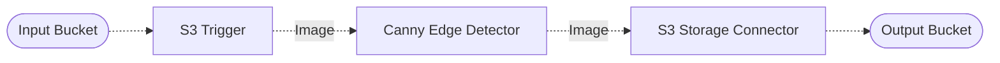

# 📏 Canny Edge Detection

> In this example, we demonstrate how to perform [canny edge detection](https://en.wikipedia.org/wiki/Canny_edge_detector) of an image within a Lakechain pipeline, and output the resulting image.

## :dna: Pipeline



## ❓ What is Happening

This example demonstrates how to use the `CannyEdgeDetector` middleware to perform edge detection on an image.

The pipeline is triggered when an image is uploaded to the source S3 bucket. The image is then processed by the `CannyEdgeDetector` middleware which computes the edges of the image using the [canny edge detection algorithm](https://en.wikipedia.org/wiki/Canny_edge_detector). The pipeline then stores the resulting image in the output S3 bucket.

<br />
<p align="center">
  <table align="center">
    <tr>
      <th>Original Image</th>
      <th>Result</th>
    </tr>
    <tr>
      <td>
        
      </td>
      <td>
        
      </td>
    </tr>
  </table>
  <p align="center">Credits to <a href="https://unsplash.com/fr/@nickkarvounis?utm_content=creditCopyText&utm_medium=referral&utm_source=unsplash">Nick Karvounis</a> sur <a href="https://unsplash.com/fr/photos/tigre-orange-sur-sol-en-beton-gris--KNNQqX9rqY?utm_content=creditCopyText&utm_medium=referral&utm_source=unsplash">Unsplash</a>
  </p>
</p>
<br />

## 📝 Requirements

The following requirements are needed to deploy the infrastructure associated with this pipeline:

- You need access to a development AWS account.
- [AWS CDK](https://docs.aws.amazon.com/cdk/latest/guide/getting_started.html#getting_started_install) is required to deploy the infrastructure.
- [Docker](https://docs.docker.com/get-docker/) is required to be running to build middlewares.
- [Node.js](https://nodejs.org/en/download/) v20+ and NPM.
- [Python](https://www.python.org/downloads/) v3.8+ and [Pip](https://pip.pypa.io/en/stable/installation/).

## 🚀 Deploy

Head to the directory [`examples/simple-pipelines/image-processing-pipelines/canny-edge-detection-pipeline`](/examples/simple-pipelines/image-processing-pipelines/canny-edge-detection-pipeline) in the repository and run the following commands to build the example:

```bash
npm install
npm run build-pkg
```

You can then deploy the example to your account (ensure your AWS CDK is configured with the appropriate AWS credentials and AWS region):

```bash
npm run deploy
```

## 🧹 Clean up

Don't forget to clean up the resources created by this example by running the following command:

```bash
npm run destroy
```
