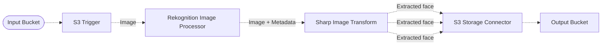

# 👤 Face Extraction Pipeline

> In this example, we will walk you through how to extract faces detected on images within pipeline, and then store those extractions on S3.

## :dna: Pipeline



## ❓ What is Happening

In this example, we are using different middlewares:

- The `S3 Trigger` provides a way to trigger a new pipeline execution whenever a new object is uploaded to an S3 bucket.
- The `Rekognition Image Processor` uses Amazon Rekognition to detect faces and passes them as metadata to the next middlewares in the pipeline.
- The `Sharp Image Transform` extracts the faces from the image.
- Finally, the `S3 Storage Connector` stores the extracted images in a destination S3 bucket.

## 📝 Requirements

The following requirements are needed to deploy the infrastructure associated with this pipeline:

- You need access to a development AWS account.
- [AWS CDK](https://docs.aws.amazon.com/cdk/latest/guide/getting_started.html#getting_started_install) is required to deploy the infrastructure.
- [Docker](https://docs.docker.com/get-docker/) is required to be running to build middlewares.
- [Node.js](https://nodejs.org/en/download/) v18+ and NPM.
- [Python](https://www.python.org/downloads/) v3.8+ and [Pip](https://pip.pypa.io/en/stable/installation/).

## 🚀 Deploy

Head to the directory [`examples/simple-pipelines/face-extraction-pipeline`](/examples/simple-pipelines/face-extraction-pipeline) in the repository and run the following commands to build the example:

```bash
npm install
npm run build-pkg
```

You can then deploy the example to your account (ensure your AWS CDK is configured with the appropriate AWS credentials and AWS region):

```bash
npm run deploy
```

## 🧹 Clean up

Don't forget to clean up the resources created by this example by running the following command:

```bash
npm run destroy
```
