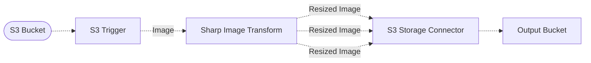

# 🖼️ Image Resize Pipeline

> In this example, we show how to use the Sharp Image Processor middleware to resize images to a collection of different sizes.

## :dna: Pipeline



## ❓ What is Happening

The Sharp Image processor middleware is based on the [`Sharp`](https://sharp.pixelplumbing.com/) library which provides a very efficient way to apply transformations to images using [`libvips`](https://www.libvips.org/). It is an ideal fit for a serverless workloads running in a Lambda environment where resources are constrained, and transform operations need to be very fast.

This example showcases how you can use the Sharp library within a Lakechain pipeline to resize an image to different sizes at scale, and store the resized images in an S3 bucket.

## 📝 Requirements

The following requirements are needed to deploy the infrastructure associated with this pipeline:

- You need access to a development AWS account.
- [AWS CDK](https://docs.aws.amazon.com/cdk/latest/guide/getting_started.html#getting_started_install) is required to deploy the infrastructure.
- [Docker](https://docs.docker.com/get-docker/) is required to be running to build middlewares.
- [Node.js](https://nodejs.org/en/download/) v20+ and NPM.
- [Python](https://www.python.org/downloads/) v3.8+ and [Pip](https://pip.pypa.io/en/stable/installation/).

## 🚀 Deploy

Head to the directory [`examples/simple-pipelines/image-processing-pipelines/image-resize-pipeline`](/examples/simple-pipelines/image-processing-pipelines/image-resize-pipeline) in the repository and run the following commands to build the example:

```bash
npm install
npm run build-pkg
```

You can then deploy the example to your account (ensure your AWS CDK is configured with the appropriate AWS credentials and AWS region):

```bash
npm run deploy
```

## 🧹 Clean up

Don't forget to clean up the resources created by this example by running the following command:

```bash
npm run destroy
```
