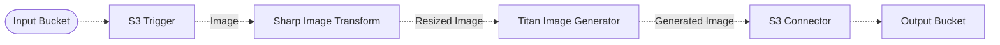

# 🧽 Object Removal Pipeline

> In this example, we showcase how to leverage Amazon Bedrock and the Amazon Titan to remove objects from images using a semantic prompt.

## :dna: Pipeline



## ❓ What is Happening

It is sometimes very useful to remove certain objects from images as a post-processing step. With the [Amazon Titan Image Generator v2](https://aws.amazon.com/fr/blogs/aws/amazon-titan-image-generator-v2-is-now-available-in-amazon-bedrock/), you can use semantic masks based on a prompt to isolate a certain subject in an image and segment it.

By using the inpainting capabilities of the Titan Image Generator v2, you can use content-aware inpainting to remove objects from images. Below is an example of the result of the image generation process executed by this example.

<br />
<p align="center">
  <table align="center">
    <tr>
      <th>Original Image</th>
      <th>Result</th>
    </tr>
    <tr>
      <td>
        
      </td>
      <td>
        
      </td>
    </tr>
  </table>
  <p align="center">Credits to Wren Meinberg on <a href="https://unsplash.com/fr/photos/chat-tigre-sur-le-rebord-AL2-t0GrSko?utm_content=creditCopyText&utm_medium=referral&utm_source=unsplash">Unsplash</a>
  </p>
</p>
<br />

To use this pipeline, simply upload an image with a cat to the input bucket, and the pipeline will automatically generate a new image without the pixels of the segmented cat, and upload it to the destination bucket.

## 📝 Requirements

The following requirements are needed to deploy the infrastructure associated with this pipeline:

- You need access to a development AWS account.
- [AWS CDK](https://docs.aws.amazon.com/cdk/latest/guide/getting_started.html#getting_started_install) is required to deploy the infrastructure.
- [Docker](https://docs.docker.com/get-docker/) is required to be running to build middlewares.
- [Node.js](https://nodejs.org/en/download/) v20+ and NPM.
- [Python](https://www.python.org/downloads/) v3.8+ and [Pip](https://pip.pypa.io/en/stable/installation/).

## 🚀 Deploy

Head to the directory [`examples/simple-pipelines/generative-pipelines/titan-object-removal-pipeline`](/examples/simple-pipelines/generative-pipelines/titan-object-removal-pipeline) in the repository and run the following commands to build the example:

```bash
npm install
npm run build-pkg
```

You can then deploy the example to your account (ensure your AWS CDK is configured with the appropriate AWS credentials and AWS region):

```bash
npm run deploy
```

## 🧹 Clean up

Don't forget to clean up the resources created by this example by running the following command:

```bash
npm run destroy
```
