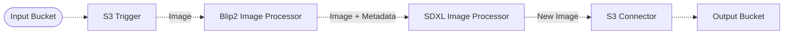

# 🧑‍🎨 Image-to-Image Pipeline

> In this example, we showcase a fun experiment where we connect two image models together in a pipeline to transform an image into a similar image using Amazon Bedrock, BLIP2 and SDXL Generative AI capabilities.

## :dna: Pipeline



## ❓ What is Happening

This example is an experiment where we ingest input image files from a source S3 bucket. We pass uploaded images into the BLIP2 image captioning model that produces a textual description of the image and then pass the textual description to Amazon Bedrock and SDXL's Generative AI capabilities to generate a new image based on the textual description.

<p align="center">
  
</p>

The `S3 Connector` stores both the initial images and the results of the pipeline in a destination S3 bucket.

> **Note**
> The BLIP2 Image Processor middleware can take a few minutes to execute, as it spawns the BLIP2 model on an ECS cluster using GPU powered instances which can take a few minutes to spin up.

## 📝 Requirements

The following requirements are needed to deploy the infrastructure associated with this pipeline:

- You need access to a development AWS account.
- [AWS CDK](https://docs.aws.amazon.com/cdk/latest/guide/getting_started.html#getting_started_install) is required to deploy the infrastructure.
- [Docker](https://docs.docker.com/get-docker/) is required to be running to build middlewares.
- [Node.js](https://nodejs.org/en/download/) v18+ and NPM.
- [Python](https://www.python.org/downloads/) v3.8+ and [Pip](https://pip.pypa.io/en/stable/installation/).

## 🚀 Deploy

Head to the directory [`examples/simple-pipelines/image-to-image-pipeline`](/examples/simple-pipelines/image-to-image-pipeline) in the repository and run the following commands to build the example:

```bash
npm install
npm run build-pkg
```

You can then deploy the example to your account (ensure your AWS CDK is configured with the appropriate AWS credentials and AWS region):

```bash
npm run deploy
```

## 🧹 Clean up

Don't forget to clean up the resources created by this example by running the following command:

```bash
npm run destroy
```
