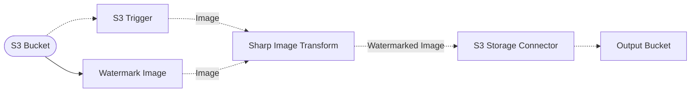

# 🖊️ Image Watermarking Pipeline

> In this example, we demonstrate how to watermark images at scale using the Sharp Image Processor middleware in a Lakechain pipeline.

## :dna: Pipeline



## ❓ What is Happening

This example showcases how you can use the Sharp library at scale to watermark images using the `composite` API provided by the [`Sharp`](https://sharp.pixelplumbing.com/) library. The `composite` API allows you to overlay images on top of each other, and is a great way to watermark images.

<br />
<p align="center">
  
</p>
<br />

In this example, we start by uploading the [watermark](./assets/watermark/watermark.png) image to the source S3 bucket within the `watermark/` prefix. We then use the **S3 Trigger** middleware to listen for any uploaded images in the `images/` prefix.

We configure the **Sharp Image Processor** to overlay the watermark image on top of the uploaded image. To do so, we use a feature of Lakechain allowing developers to reference external objects, and pass those references to compatible middleware parameters.

```typescript
const imageTransform = new SharpImageTransform.Builder()
  .withScope(this)
  .withIdentifier('SharpTransform')
  .withCacheStorage(cache)
  .withSource(trigger)
  .withSharpTransforms(
    sharp()
      .resize(500)
      .composite([{
        input: r.reference(
          r.url(`s3://${source.bucketName}/watermark/watermark.png`)
        )
      }])
      .png()
  )
  .build();
```

Note how we use a `r.reference` on an `r.url` as a value of the `input` parameter. At runtime, the middleware will resolve the reference to the actual object, and pass it to the `composite` API.

## 📝 Requirements

The following requirements are needed to deploy the infrastructure associated with this pipeline:

- You need access to a development AWS account.
- [AWS CDK](https://docs.aws.amazon.com/cdk/latest/guide/getting_started.html#getting_started_install) is required to deploy the infrastructure.
- [Docker](https://docs.docker.com/get-docker/) is required to be running to build middlewares.
- [Node.js](https://nodejs.org/en/download/) v18+ and NPM.
- [Python](https://www.python.org/downloads/) v3.8+ and [Pip](https://pip.pypa.io/en/stable/installation/).

## 🚀 Deploy

Head to the directory [`examples/simple-pipelines/image-watermarking-pipeline`](/examples/simple-pipelines/image-watermarking-pipeline) in the repository and run the following commands to build the example:

```bash
npm install
npm run build-pkg
```

You can then deploy the example to your account (ensure your AWS CDK is configured with the appropriate AWS credentials and AWS region):

```bash
npm run deploy
```

## 🧹 Clean up

Don't forget to clean up the resources created by this example by running the following command:

```bash
npm run destroy
```
