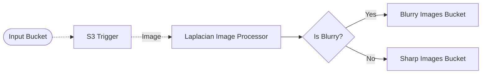

# 🖼️ Laplacian Variance Pipeline

> In this example, we demonstrate how to compute the [Laplacian variance](https://theailearner.com/2021/10/30/blur-detection-using-the-variance-of-the-laplacian-method/) of an image within a Lakechain pipeline, and infer whether that image is blurry or not, by using a variance threshold.

## :dna: Pipeline



## ❓ What is Happening

This example demonstrates how to compute the Laplacian variance of images within a pipeline and infer whether the image is blurry or not.

The pipeline is triggered when an image is uploaded to the source S3 bucket. The image is then processed by the `Laplacian Image Processor` middleware which computes the Laplacian variance of the image and enriches its document metadata. The pipeline then uses a filter to determine whether the image is blurry or not. If the image is blurry, it is stored in the `Blurry Images Bucket`, otherwise, it is stored in the `Sharp Images Bucket`.

> 💁 Please note that the Laplacian variance can raise false-positives, and heavily depends on the used threshold.

<br />
<p align="center">
  
</p>
<br />

## 📝 Requirements

The following requirements are needed to deploy the infrastructure associated with this pipeline:

- You need access to a development AWS account.
- [AWS CDK](https://docs.aws.amazon.com/cdk/latest/guide/getting_started.html#getting_started_install) is required to deploy the infrastructure.
- [Docker](https://docs.docker.com/get-docker/) is required to be running to build middlewares.
- [Node.js](https://nodejs.org/en/download/) v18+ and NPM.
- [Python](https://www.python.org/downloads/) v3.8+ and [Pip](https://pip.pypa.io/en/stable/installation/).

## 🚀 Deploy

Head to the directory [`examples/simple-pipelines/laplacian-variance-pipeline`](/examples/simple-pipelines/laplacian-variance-pipeline) in the repository and run the following commands to build the example:

```bash
npm install
npm run build-pkg
```

You can then deploy the example to your account (ensure your AWS CDK is configured with the appropriate AWS credentials and AWS region):

```bash
npm run deploy
```

## 🧹 Clean up

Don't forget to clean up the resources created by this example by running the following command:

```bash
npm run destroy
```
