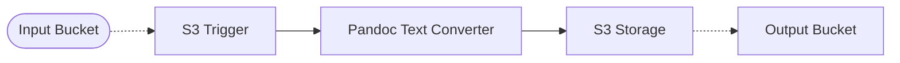

# 🔑 Encryption Pipeline

> In this example, we will walk you through how to create an end-to-end encrypted pipeline using [AWS KMS](https://aws.amazon.com/kms/).

## :dna: Pipeline



## ❓ What is Happening

In this example, we are implementing a simple document conversion pipeline using Pandoc to convert `Markdown` and `Docx` documents to `HTML`. The goal of this example is to demonstrate how to use one or multiple KMS keys to encrypt the processing of documents at rest using a Customer Managed Key (CMK).

> 💁 Encryption in transit is already enabled by default in Project Lakechain.

## 📝 Requirements

The following requirements are needed to deploy the infrastructure associated with this pipeline:

- You need access to a development AWS account.
- [AWS CDK](https://docs.aws.amazon.com/cdk/latest/guide/getting_started.html#getting_started_install) is required to deploy the infrastructure.
- [Docker](https://docs.docker.com/get-docker/) is required to be running to build middlewares.
- [Node.js](https://nodejs.org/en/download/) v18+ and NPM.
- [Python](https://www.python.org/downloads/) v3.8+ and [Pip](https://pip.pypa.io/en/stable/installation/).

## 🚀 Deploy

Head to the directory [`examples/simple-pipelines/pipeline-encryption`](/examples/simple-pipelines/pipeline-encryption) in the repository and run the following commands to build the example:

```bash
npm install
npm run build-pkg
```

You can then deploy the example to your account (ensure your AWS CDK is configured with the appropriate AWS credentials and AWS region):

```bash
npm run deploy
```

## 🧹 Clean up

Don't forget to clean up the resources created by this example by running the following command:

```bash
npm run destroy
```
