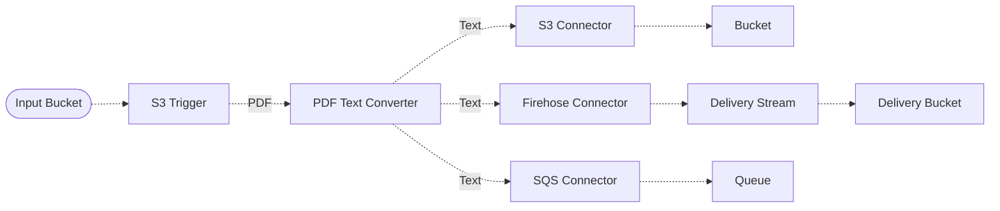

# 🔌 Storage Connector Pipeline

> In this example, we create a pipeline that forwards processing results to other AWS services using storage connectors supported by Lakechain.

## :dna: Pipeline



## ❓ What is Happening

It is important for pipeline developers to be able to connect the processing results of pipelines to other AWS services or applications for storage or further processing purposes. Project Lakechain provides a set of storage connectors that can be used to forward the results of a pipeline to other AWS services without having to write the integration code yourself.

In this example, we handle PDF documents uploaded from an S3 bucket, convert them into text, and forward an event referencing the result of the conversion to a user-provided S3 bucket, SQS queue, and Kinesis Firehose delivery stream.

## 🗒️ How it works

In order to witness the results of all the connectors, this example creates the following output resources:

- An S3 bucket in which the `S3 Storage Connector` will store the results of the pipeline
- A firehose delivery stream that will store its results to its own S3 bucket
- An SQS queue in which the `SQS Storage Connector` will store the results of the pipeline

## 📝 Requirements

The following requirements are needed to deploy the infrastructure associated with this pipeline:

- You need access to a development AWS account.
- [AWS CDK](https://docs.aws.amazon.com/cdk/latest/guide/getting_started.html#getting_started_install) is required to deploy the infrastructure.
- [Docker](https://docs.docker.com/get-docker/) is required to be running to build middlewares.
- [Node.js](https://nodejs.org/en/download/) v20+ and NPM.
- [Python](https://www.python.org/downloads/) v3.8+ and [Pip](https://pip.pypa.io/en/stable/installation/).

## 🚀 Deploy

Head to the directory [`examples/simple-pipelines/storage-connector-pipeline`](/examples/simple-pipelines/storage-connector-pipeline) in the repository and first run `npm` to install the pipeline dependencies:

```bash
npm install
npm run build-pkg
```

You can then deploy the example to your account (ensure your AWS CDK is configured with the appropriate AWS credentials and AWS region):

```bash
npm run deploy
```

## 🧹 Clean up

Don't forget to clean up the resources created by this example by running the following command:

```bash
npm run destroy
```
