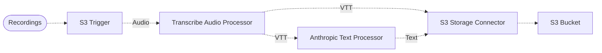

# 🎤 Audio Recording Summarization Pipeline

> This example showcases how to ingest audio recordings, transcribe the audio into a textual format, and summarize the text using Amazon Transcribe and Amazon Bedrock.

## :dna: Pipeline



## ❓ What is Happening

In this pipeline, we demonstrate how to summarize audio recordings using Amazon Transcribe and the Anthropic [Claude v3 Sonnet](https://aws.amazon.com/fr/about-aws/whats-new/2024/03/anthropics-claude-3-sonnet-model-amazon-bedrock/) model hosted on Amazon bedrock.

<p align="center">
  
</p>

Using this pipeline, you can streamline the process of summarizing podcasts, personal recordings, or meeting recordings in your organization, without the data leaving AWS.

This pipeline stores the result of the transcription and the summary in a destination bucket, such that you can compare the original transcription with the summary.

## 📝 Requirements

The following requirements are needed to deploy the infrastructure associated with this pipeline:

- You need access to a development AWS account.
- [AWS CDK](https://docs.aws.amazon.com/cdk/latest/guide/getting_started.html#getting_started_install) is required to deploy the infrastructure.
- [Docker](https://docs.docker.com/get-docker/) is required to be running to build middlewares.
- [Node.js](https://nodejs.org/en/download/) v18+ and NPM.
- [Python](https://www.python.org/downloads/) v3.8+ and [Pip](https://pip.pypa.io/en/stable/installation/).

## 🚀 Deploy

Head to the directory [`examples/simple-pipelines/summarization-pipelines/audio-recording-summarization-pipeline`](/examples/simple-pipelines/summarization-pipelines/audio-recording-summarization-pipeline) in the repository and run the following commands to build the example:

```bash
npm install
npm run build-pkg
```

You can then deploy the example to your account (ensure the AWS CDK is installed and is configured with the appropriate AWS credentials and AWS region):

```bash
npm run deploy
```

## 🧹 Clean up

Don't forget to clean up the resources created by this example by running the following command:

```bash
npm run destroy
```
