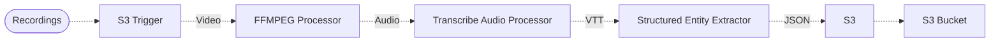
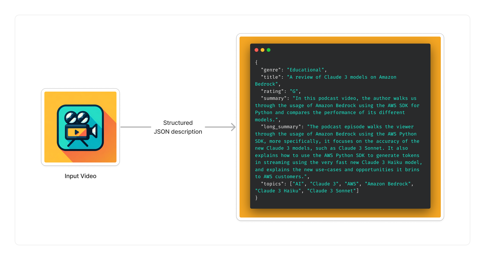

# 🎥 Video Summarization Pipeline

> This example showcases how to ingest videos, transcribe their audio track into a textual format, summarize the video and extract metadata from it in a structured way using Amazon Bedrock.

## :dna: Pipeline



## ❓ What is Happening

In this pipeline, we demonstrate how to summarize and extract metadata from videos using Amazon Transcribe and Amazon Bedrock.

> 💁 The pipeline takes an input video from the pipeline source bucket and outputs a structured JSON document with metadata describing the video.

<br />
<p align="center">
  
</p>
<br />

Using this pipeline, you can streamline the process of metadata extraction on videos including video podcasts, TV shows, daily news, etc. without your data leaving AWS.

> The result of the structured data extraction is stored in the destination bucket.

## 📝 Requirements

The following requirements are needed to deploy the infrastructure associated with this pipeline:

- You need access to a development AWS account.
- [AWS CDK](https://docs.aws.amazon.com/cdk/latest/guide/getting_started.html#getting_started_install) is required to deploy the infrastructure.
- [Docker](https://docs.docker.com/get-docker/) is required to be running to build middlewares.
- [Node.js](https://nodejs.org/en/download/) v20+ and NPM.
- [Python](https://www.python.org/downloads/) v3.8+ and [Pip](https://pip.pypa.io/en/stable/installation/).

## 🚀 Deploy

Head to the directory [`examples/simple-pipelines/summarization-pipelines/video-summarization-pipeline`](/examples/simple-pipelines/summarization-pipelines/video-summarization-pipeline) in the repository and run the following commands to build the example:

```bash
npm install
npm run build-pkg
```

You can then deploy the example to your account (ensure the AWS CDK is installed and is configured with the appropriate AWS credentials and AWS region):

```bash
npm run deploy
```

## 🧹 Clean up

Don't forget to clean up the resources created by this example by running the following command:

```bash
npm run destroy
```
