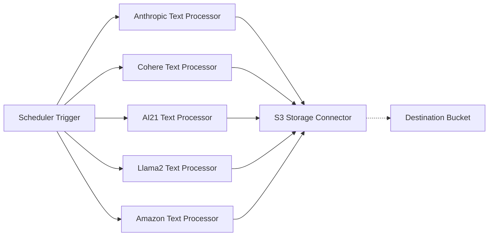

# 📝 Text Generation Pipeline

> In this example, we showcase how to prompt different Amazon Bedrock models to generate a poem about cloud computing on AWS. Each model is executed in parallel, and the results are then stored in a destination bucket.

## :dna: Pipeline



## ❓ What is Happening

In this example, we want to demonstrate the usage of the `Scheduler` trigger that can schedule the trigger of a pipeline at a specific time, or given a periodic schedule. In this context, we demonstrate the usage of several Amazon Bedrock text models that we prompt to generate a poem 5 minutes after the stack deployment.

<br />
<p align="center">
  
</p>
<br />

The generated poems are stored in the destination bucket defined in the pipeline stack.

> You can modify the pipeline as you see fit to make it, for example, recurrent (e.g generate text every 5 minutes for example).

## 📝 Requirements

The following requirements are needed to deploy the infrastructure associated with this pipeline:

- You need access to a development AWS account.
- [AWS CDK](https://docs.aws.amazon.com/cdk/latest/guide/getting_started.html#getting_started_install) is required to deploy the infrastructure.
- [Docker](https://docs.docker.com/get-docker/) is required to be running to build middlewares.
- [Node.js](https://nodejs.org/en/download/) v18+ and NPM.
- [Python](https://www.python.org/downloads/) v3.8+ and [Pip](https://pip.pypa.io/en/stable/installation/).

## 🚀 Deploy

Head to the directory [`examples/simple-pipelines/text-generation-pipeline`](/examples/simple-pipelines/text-generation-pipeline) in the repository and run the following commands to build the example:

```bash
npm install
npm run build-pkg
```

You can then deploy the example to your account (ensure your AWS CDK is configured with the appropriate AWS credentials and AWS region):

```bash
npm run deploy
```

## 🧹 Clean up

Don't forget to clean up the resources created by this example by running the following command:

```bash
npm run destroy
```
