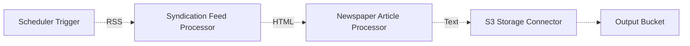

# 📖 Article Curation Pipeline

> This example showcases how to ingest articles and blog posts from RSS feeds, extract each linked article in the form of HTML documents on the Web and extract the relevant text associated with the articles using the [Newspaper3k NLP library](https://newspaper.readthedocs.io/en/latest/) and Project Lakechain.

## :dna: Pipeline



## ❓ What is Happening

In this pipeline, we analyze a set of articles and blog post from different [AWS Blogs](https://aws.amazon.com/blogs/). The `SchedulerEventTrigger` middleware is used to specify a static list of RSS feeds that trigger a pipeline at a given time, or on a schedule.

In this example, we trigger the pipeline _10 minutes_ after the deployment of the example starts such that it executes automatically, but you can modify the example as you see fit to regularly inspect AWS Blogs for new articles.

Once the pipeline is triggered, the pipeline extracts from the RSS feeds the latest articles and then extracts from the gathered raw HTML documents the relevant text of the article using the `Newspaper3k` middleware which provides an NLP model that is optimized for HTML article text extraction.

This provides a powerful way to analyze and extract the substance of HTML documents on the Web and use that text as an input to other middlewares in your pipeline.

<p align="center">
  
</p>

> This can come in handy when building Retrieval Augmented Generation pipelines that need to periodically analyze the content of articles or blog posts on the Web.

In addition to extracting the text from articles or blog posts, the `Newspaper3k` middleware also attempts to extract metadata from the HTML documents such as their creation date, authors of the article, the title of the page, a summary of the article, etc. These metadata are enriched in the document metadata and stored on S3 along with the extracted text.

## 📝 Requirements

The following requirements are needed to deploy the infrastructure associated with this pipeline:

- You need access to a development AWS account.
- [AWS CDK](https://docs.aws.amazon.com/cdk/latest/guide/getting_started.html#getting_started_install) is required to deploy the infrastructure.
- [Docker](https://docs.docker.com/get-docker/) is required to be running to build middlewares.
- [Node.js](https://nodejs.org/en/download/) v20+ and NPM.
- [Python](https://www.python.org/downloads/) v3.8+ and [Pip](https://pip.pypa.io/en/stable/installation/).

## 🚀 Deploy

Head to the directory [`examples/simple-pipelines/text-processing-pipelines/article-curation`](/examples/simple-pipelines/text-processing-pipelines/article-curation) in the repository and run the following commands to build the example:

```bash
npm install
npm run build-pkg
```

You can then deploy the example to your account (ensure the AWS CDK is installed and is configured with the appropriate AWS credentials and AWS region):

```bash
npm run deploy
```

> ℹ️ Note that this pipeline will automatically trigger the pipeline 10 minutes after the deployment of the stack. You can see the result of the execution in CloudWatch Logs and in the destination bucket. Also note that you can re-deploy this example at any time to trigger the pipeline again.

## 🧹 Clean up

Don't forget to clean up the resources created by this example by running the following command:

```bash
npm run destroy
```
