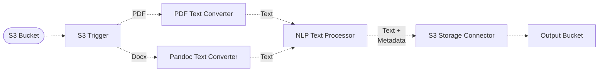

# ✍️ NLP Pipeline

In this example, we showcase how to ingest textual documents from different formats and process them using the NLP Text Processor middleware. The NLP text processor exposes various capabilities powered by Amazon Comprehend to analyze text, including:

- [Language detection](https://docs.aws.amazon.com/comprehend/latest/dg/how-languages.html)
- [Named entity recognition](https://docs.aws.amazon.com/comprehend/latest/dg/how-entities.html)
- [PII detection](https://docs.aws.amazon.com/comprehend/latest/dg/how-pii.html)
- [Part of speech tagging](https://docs.aws.amazon.com/comprehend/latest/dg/how-syntax.html)

In this pipeline, we ingest documents uploaded to a source S3 bucket which can include PDF or Docx documents, and run an NLP analysis on them. The results of the analysis are then stored in a destination S3 bucket.

## :dna: Pipeline



## 📝 Requirements

The following requirements are needed to deploy the infrastructure associated with this pipeline:

- You need access to a development AWS account.
- [AWS CDK](https://docs.aws.amazon.com/cdk/latest/guide/getting_started.html#getting_started_install) is required to deploy the infrastructure.
- [Docker](https://docs.docker.com/get-docker/) is required to be running to build middlewares.
- [Node.js](https://nodejs.org/en/download/) v18+ and NPM.
- [Python](https://www.python.org/downloads/) v3.8+ and [Pip](https://pip.pypa.io/en/stable/installation/).

## 🚀 Deploy

Head to the directory [`examples/simple-pipelines/nlp-pipeline`](/examples/simple-pipelines/nlp-pipeline) in the repository and first run `npm` to install the pipeline dependencies:

```bash
npm install
npm run build-pkg
```

You can then deploy the example to your account (ensure your AWS CDK is configured with the appropriate AWS credentials and AWS region):

```bash
npm run deploy
```

## 🧹 Clean up

Don't forget to clean up the resources created by this example by running the following command:

```bash
npm run destroy
```
