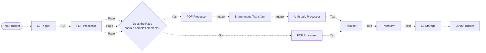

# 👀 PDF Vision Pipeline

> In this example, we showcase an experiment leveraging a vision model to parse complex PDF documents. Please note that this is only an experiment and not intended for production use.

## :dna: Pipeline



## ❓ What is Happening

In this example, we are building an experimental pipeline which leverages a vision model to transcribe the content of complex pages within PDF documents. Below is a different diagram that focuses on the process rather than middlewares.

<p align="center">
  
</p>

The way it works is documented below.

1. The pipeline starts with an S3 trigger that listens to a bucket for new PDF files.
2. When a new PDF document is uploaded, we start by extracting each pages from it and forwarding them to a conditional statement.
3. The conditional statement checks if the page contains complex elements such as images or tables.
4. If the page does not contain complex elements, we use a PDF text converter to extract the text from the page in a traditional way.
5. If the page contains complex elements, we convert the page to an image and forward it to a vision model which we prompt to transcribe the text.
6. The text extracted from the vision model is then concatenated with the text extracted from the PDF text converter.
7. The concatenated text is then stored in an S3 bucket.

## ℹ️ Considerations

Using an image model to transcribe text from complex pages is an experimental approach that is considerably longer and more expensive than using traditional PDF text extraction.

The goal of this experiment is to study the results of using a vision model to extract text from complex pages against traditional text extraction methods. The results of this experiment can be used to determine the feasibility of using vision models to extract text from complex pages.

## 📝 Requirements

The following requirements are needed to deploy the infrastructure associated with this pipeline:

- You need access to a development AWS account.
- [AWS CDK](https://docs.aws.amazon.com/cdk/latest/guide/getting_started.html#getting_started_install) is required to deploy the infrastructure.
- [Docker](https://docs.docker.com/get-docker/) is required to be running to build middlewares.
- [Node.js](https://nodejs.org/en/download/) v20+ and NPM.
- [Python](https://www.python.org/downloads/) v3.8+ and [Pip](https://pip.pypa.io/en/stable/installation/).

## 🚀 Deploy

Head to the directory [`examples/simple-pipelines/text-processing-pipelines/pdf-vision-pipeline`](/examples/simple-pipelines/text-processing-pipelines/pdf-vision-pipeline) in the repository and run the following commands to build the example:

```bash
npm install
npm run build-pkg
```

You can then deploy the example to your account (ensure your AWS CDK is configured with the appropriate AWS credentials and AWS region):

```bash
npm run deploy
```

## 🧹 Clean up

Don't forget to clean up the resources created by this example by running the following command:

```bash
npm run destroy
```
