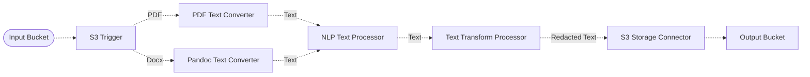

# :bust_in_silhouette: PII Redaction Pipeline

> This is an example of how to remove PII and confidential data from text documents in a pipeline using Amazon Comprehend.

## :dna: Pipeline



## ❓ What is Happening

> **Warning**
> PII detection in Amazon Comprehend will currently work on english documents only. **Also note that this is pipeline is an example, do not use as is in production.**

In this pipeline, we take text documents (including PDF and Docx) as an input from an S3 bucket.

The documents are converted into plain text and passed to the **NLP Text Processor** that will identify the language of the document and extract PII data from the text using Amazon Comprehend.

The **Text Transform Processor** will then replace the PII data with a placeholder and store the result in a destination S3 bucket.

<br />
<p align="center">
  
</p>
<br />

This pipeline stores the result of the PII redaction in a destination bucket.

## 📝 Requirements

The following requirements are needed to deploy the infrastructure associated with this pipeline:

- You need access to a development AWS account.
- [AWS CDK](https://docs.aws.amazon.com/cdk/latest/guide/getting_started.html#getting_started_install) is required to deploy the infrastructure.
- [Docker](https://docs.docker.com/get-docker/) is required to be running to build middlewares.
- [Node.js](https://nodejs.org/en/download/) v20+ and NPM.
- [Python](https://www.python.org/downloads/) v3.8+ and [Pip](https://pip.pypa.io/en/stable/installation/).

## 🚀 Deploy

Head to the directory [`examples/simple-pipelines/text-processing-pipelines/pii-redaction-pipeline`](/examples/simple-pipelines/text-processing-pipelines/pii-redaction-pipeline) in the repository and run the following commands to build the example:

```bash
npm install
npm run build-pkg
```

You can then deploy the example to your account (ensure the AWS CDK is installed and is configured with the appropriate AWS credentials and AWS region):

```bash
npm run deploy
```

## 🧹 Clean up

Don't forget to clean up the resources created by this example by running the following command:

```bash
npm run destroy
```
