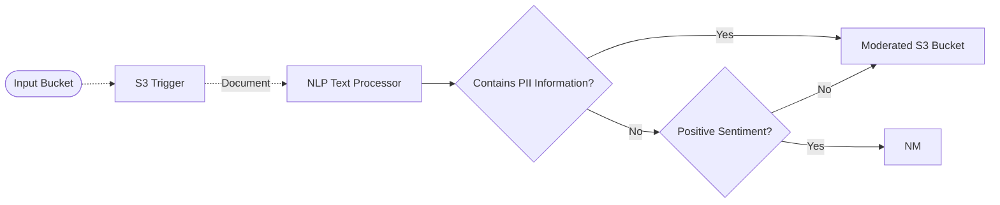

# 👮 Text Moderation Pipeline

> In this example, we leverage the NLP Text Processor middleware and conditionals to classify whether a given input document requires moderation.

## :dna: Pipeline



## ❓ What is Happening

This pipeline provides an example of how to classify documents into different buckets: documents that require manual moderation and documents that can be safely used.

We use the PII detection and Sentiment Analysis features provided by the Amazon Comprehend service to do moderated content classification and provide easy ways to customize it through the NLP Text Processor middleware.

## 📝 Requirements

The following requirements are needed to deploy the infrastructure associated with this pipeline:

- You need access to a development AWS account.
- [AWS CDK](https://docs.aws.amazon.com/cdk/latest/guide/getting_started.html#getting_started_install) is required to deploy the infrastructure.
- [Docker](https://docs.docker.com/get-docker/) is required to be running to build middlewares.
- [Node.js](https://nodejs.org/en/download/) v20+ and NPM.
- [Python](https://www.python.org/downloads/) v3.8+ and [Pip](https://pip.pypa.io/en/stable/installation/).

## 🚀 Deploy

Head to the directory [`examples/simple-pipelines/text-processing-pipelines/text-moderation-pipeline`](/examples/simple-pipelines/text-processing-pipelines/text-moderation-pipeline) in the repository and run the following commands to build the example:

```bash
npm install
npm run build-pkg
```

You can then deploy the example to your account (ensure your AWS CDK is configured with the appropriate AWS credentials and AWS region):

```bash
npm run deploy
```

## 🧹 Clean up

Don't forget to clean up the resources created by this example by running the following command:

```bash
npm run destroy
```
