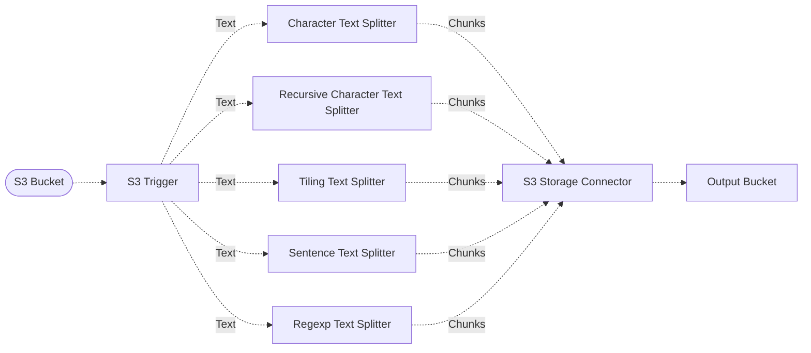

# :page_facing_up: Text Splitting

> In this example, we showcase different methods for splitting text, a practice commonly used in document pre-processing tasks, using different middlewares each implementing different text splitting algorithms.

## :dna: Pipeline



## ❓ What is Happening

In this pipeline, we ingest text documents uploaded to a source S3 bucket, and we split each one of them into different chunks using different middlewares. The results of the text splitting are then stored in a destination S3 bucket where you can compare the results of the different algorithms.

The middlewares used in this pipeline are:

- **Character Text Splitter** - splits text on a character, into a fixed size per chunk.
- **Recursive Character Text Splitter** - splits text based on characters and measure chunk length by number of characters.
- **Tiling Text Splitter** - splits text into chunks of a given number of characters using a tiling algorithm provided by [NLTK](https://www.nltk.org/).
- **Sentence Text Splitter** - splits text into chunks of a maximum number of bytes, while respecting sentence boundaries.
- **Regexp Text Splitter** - splits text based on a string or regular expression.

> 💁 The text splitters will emit chunks as multiple documents. The destination S3 bucket will therefore contain one object per chunk, per text splitter.

## 📝 Requirements

The following requirements are needed to deploy the infrastructure associated with this pipeline:

- You need access to a development AWS account.
- [AWS CDK](https://docs.aws.amazon.com/cdk/latest/guide/getting_started.html#getting_started_install) is required to deploy the infrastructure.
- [Docker](https://docs.docker.com/get-docker/) is required to be running to build middlewares.
- [Node.js](https://nodejs.org/en/download/) v20+ and NPM.
- [Python](https://www.python.org/downloads/) v3.8+ and [Pip](https://pip.pypa.io/en/stable/installation/).

## 🚀 Deploy

Head to the directory [`examples/simple-pipelines/text-processing-pipelines/text-splitting-pipeline`](/examples/simple-pipelines/text-processing-pipelines/text-splitting-pipeline) in the repository and first run `npm` to install the pipeline dependencies:

```bash
npm install
npm run build-pkg
```

You can then deploy the example to your account (ensure your AWS CDK is configured with the appropriate AWS credentials and AWS region):

```bash
npm run deploy
```

## 🧹 Clean up

Don't forget to clean up the resources created by this example by running the following command:

```bash
npm run destroy
```
