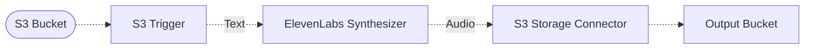

# 🗣️ ElevenLabs Synthesizer

> In this example, we showcase how to ingest text documents in different formats and synthesize them into speech using the [ElevenLabs](https://elevenlabs.io/) API.

To use this example, you upload a text document to an S3 bucket. The pipeline is triggered by the S3 event, and the text content is synthesized into an audio file using the ElevenLabs API. The synthesized audio file is then stored in another S3 bucket.

The ElevenLabs synthesizer automatically throttles calls made to the ElevenLabs API for synthesizing text into audio files to stay within the [ElevenLabs API Limits](https://help.elevenlabs.io/hc/en-us/articles/14312733311761-How-many-requests-can-I-make-and-can-I-increase-it).

This example uses by default the `Rachel` voice tailored for English narration speech generation, and the latest `eleven_multilingual_v2` model.

> 💁 See the [ElevenLabs pre-maid voices](https://elevenlabs.io/docs/voices/premade-voices) and the [ElevenLabs models](https://elevenlabs.io/docs/speech-synthesis/models) for more information on the available voices and models.

## :dna: Pipeline



## 📝 Requirements

The following requirements are needed to deploy the infrastructure associated with this pipeline:

- You need access to a development AWS account.
- [AWS CDK](https://docs.aws.amazon.com/cdk/latest/guide/getting_started.html#getting_started_install) is required to deploy the infrastructure.
- [Docker](https://docs.docker.com/get-docker/) is required to be running to build middlewares.
- [Node.js](https://nodejs.org/en/download/) v20+ and NPM.
- [Python](https://www.python.org/downloads/) v3.8+ and [Pip](https://pip.pypa.io/en/stable/installation/).

## 🚀 Deploy

Head to the directory [`examples/simple-pipelines/text-to-speech-pipelines/elevenlabs-synthesizer`](/examples/simple-pipelines/text-to-speech-pipelines/elevenlabs-synthesizer) in the repository and first run `npm` to install the pipeline dependencies:

```bash
npm install
npm run build-pkg
```

You can then deploy the example to your account (ensure your AWS CDK is configured with the appropriate AWS credentials and AWS region):

```bash
npm run deploy
```

## 🧹 Clean up

Don't forget to clean up the resources created by this example by running the following command:

```bash
npm run destroy
```
