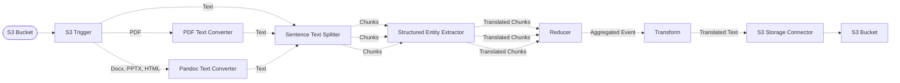

# 🤖 Bedrock Translation Pipeline

> This example showcases how to translate documents using a large-language model hosted on Amazon Bedrock.

## :dna: Pipeline



## ❓ What is Happening

In this pipeline, we demonstrate how to translate long-form documents using a large-language model such as the [Claude v3 Sonnet](https://aws.amazon.com/fr/about-aws/whats-new/2024/03/anthropics-claude-3-sonnet-model-amazon-bedrock/) model hosted on Amazon bedrock.

Due to the limitation of 4k output tokens of many LLMs, we take input documents (Text, PDF, Docx, HTML, etc.) and chunk them using the [Sentence Text Splitter](https://awslabs.github.io/project-lakechain/text-splitters/sentence-text-splitter/) middleware while preserving sentence boundaries.

Each chunk is then translated using the `Structured Entity Extractor` middleware to french (this can be changed by modifying the prompt in the example) as a structured JSON document. The translated chunks are then aggregated into a single document using the `Reducer` middleware, sorted by the original order of the chunks, and transformed back into a single text file stored in a destination S3 bucket.

## 📝 Requirements

The following requirements are needed to deploy the infrastructure associated with this pipeline:

- You need access to a development AWS account.
- [AWS CDK](https://docs.aws.amazon.com/cdk/latest/guide/getting_started.html#getting_started_install) is required to deploy the infrastructure.
- [Docker](https://docs.docker.com/get-docker/) is required to be running to build middlewares.
- [Node.js](https://nodejs.org/en/download/) v20+ and NPM.
- [Python](https://www.python.org/downloads/) v3.8+ and [Pip](https://pip.pypa.io/en/stable/installation/).

## 🚀 Deploy

Head to the directory [`examples/simple-pipelines/text-translation-pipelines/bedrock-translation-pipeline`](/examples/simple-pipelines/text-translation-pipelines/bedrock-translation-pipeline) in the repository and run the following commands to build the example:

```bash
npm install
npm run build-pkg
```

You can then deploy the example to your account (ensure the AWS CDK is installed and is configured with the appropriate AWS credentials and AWS region):

```bash
npm run deploy
```

## 🧹 Clean up

Don't forget to clean up the resources created by this example by running the following command:

```bash
npm run destroy
```
