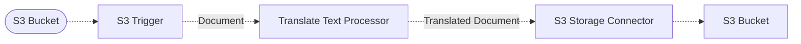

# 🖌️ Translate Pipeline

> This example showcases how to translate documents within a pipeline using Amazon Translate and Project Lakechain.

## :dna: Pipeline



## ❓ What is Happening

In this pipeline, we demonstrate how to translate long-form documents using Amazon Translate within a Lakechain pipeline.

To do so, this pipeline uses the [Translate Text Processor](http://localhost:4321/project-lakechain/text-processing/translate-text-processor) which integrates with Amazon Translate and supports various document formats such as Text, HTML, Docx, PowerPoint, Excel, and Xliff.

> 💁 Using Amazon Translate, the input documents formatting and structure is preserved during the translation process, and the output documents are stored in the same format as the input documents.

The translated documents (this example translates by default input documents to french and spanish) are then stored in a destination S3 bucket.

## 📝 Requirements

The following requirements are needed to deploy the infrastructure associated with this pipeline:

- You need access to a development AWS account.
- [AWS CDK](https://docs.aws.amazon.com/cdk/latest/guide/getting_started.html#getting_started_install) is required to deploy the infrastructure.
- [Docker](https://docs.docker.com/get-docker/) is required to be running to build middlewares.
- [Node.js](https://nodejs.org/en/download/) v20+ and NPM.
- [Python](https://www.python.org/downloads/) v3.8+ and [Pip](https://pip.pypa.io/en/stable/installation/).

## 🚀 Deploy

Head to the directory [`examples/simple-pipelines/text-translation-pipelines/translate-pipeline`](/examples/simple-pipelines/text-translation-pipelines/translate-pipeline) in the repository and run the following commands to build the example:

```bash
npm install
npm run build-pkg
```

You can then deploy the example to your account (ensure the AWS CDK is installed and is configured with the appropriate AWS credentials and AWS region):

```bash
npm run deploy
```

## 🧹 Clean up

Don't forget to clean up the resources created by this example by running the following command:

```bash
npm run destroy
```
