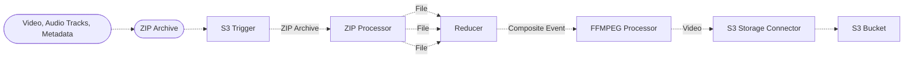

# 🎥 Audio Combination Pipeline

> This example showcases how to ingest add multiple audio tracks to one video using ffmpeg on AWS.

## :dna: Pipeline



## ❓ What is Happening

In this pipeline, we demonstrate how to add multiple audio tracks to a video with the ffmpeg middleware by using composite events.

1. The pipeline starts by ingesting a ZIP archive containing the video, audio tracks, as well as a metadata file.
2. The ZIP archive is processed by the `ZIP Processor` middleware, which extracts the files and sends them to the `Reducer` middleware.
3. The `Reducer` middleware combines the files into a single event that is sent to the `FFMPEG Processor`.
4. The `FFMPEG Processor` middleware uses the ffmpeg command to combine the audio tracks with the video.
5. The generated video is then uploaded to an S3 bucket.

Using this pipeline, you can streamline the process of creating questions to test your knowledge about the content of various documents, including videos, podcasts, scientific papers, etc. without your data leaving AWS.

## 🗒️ How to Use

1. Deploy the pipeline using the instructions below.
This will create the necessary resources in your AWS account and output the source and destination S3 buckets.
2. Create a JSON metadata file with the following structure:
```json
{
  "video": "video_name.mp4",
  "tracks": ["track1_name.mp3", "track2_name.mp3"]
}
```
> ⚠️ The extensions of the files determine the type of file they are, so ensure they are correct. The file formats supported are any of the video and audio files [compatible with ffmpeg](https://ffmpeg.org/ffmpeg-formats.html#Demuxers).
3. Create a ZIP archive that contains the video, audio tracks, and the metadata file.
4. Upload the ZIP archive to the S3 source bucket. For example, you can use the AWS CLI as described [here](https://docs.aws.amazon.com/cli/latest/reference/s3/cp.html#examples).
5. The pipeline will automatically process the ZIP archive and add the generated video to the destination bucket.
6. You can download the generated video from the destination bucket and view it to see the audio tracks combined with the video.
> ⚠️ Known limitation: The output will be as long as the longest input file.

## 📝 Requirements

The following requirements are needed to deploy the infrastructure associated with this pipeline:

- You need access to a development AWS account.
- [AWS CDK](https://docs.aws.amazon.com/cdk/latest/guide/getting_started.html#getting_started_install) is required to deploy the infrastructure.
- [Docker](https://docs.docker.com/get-docker/) is required to be running to build middlewares.
- [Node.js](https://nodejs.org/en/download/) v18+ and NPM.
- [Python](https://www.python.org/downloads/) v3.8+ and [Pip](https://pip.pypa.io/en/stable/installation/).

## 🚀 Deploy

Head to the directory [`examples/simple-pipelines/video-processing-pipelines/audio-combination-pipeline`](/examples/simple-pipelines/video-processing-pipelines/audio-combination-pipeline) in the repository and run the following commands to build the example:

```bash
npm install
npm run build-pkg
```

You can then deploy the example to your account (ensure the AWS CDK is installed and is configured with the appropriate AWS credentials and AWS region):

```bash
npm run deploy
```

## 🧹 Clean up

Don't forget to clean up the resources created by this example by running the following command:

```bash
npm run destroy
```
