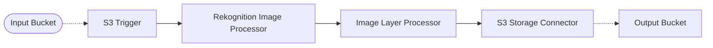

# 🚧 VPC Private Pipeline

> In this example, we show how to deploy middlewares in a VPC without internet access, and how to leverage [VPC Endpoints](https://docs.aws.amazon.com/whitepapers/latest/aws-privatelink/what-are-vpc-endpoints.html) to allow middlewares to interact with AWS services.

## :dna: Pipeline



## ❓ What is Happening

In this example, we are re-implementing the [Face Detection Pipeline](/examples/simple-pipelines/face-detection-pipeline) example, but this time we are deploying the middlewares in a VPC without internet access.

This enables customers that have strict requirements about security to run middlewares in a VPC, and still be able to interact with AWS services. To achieve this, we are using [VPC Endpoints](https://docs.aws.amazon.com/whitepapers/latest/aws-privatelink/what-are-vpc-endpoints.html) to allow middlewares to interact with AWS services without going through the internet.

> 💁 Below is an end-to-end representation of the flow of data between middlewares, and the VPC endpoints the data goes through.

<br />
<p align="center">
  
</p>
<br />

## 📝 Requirements

The following requirements are needed to deploy the infrastructure associated with this pipeline:

- You need access to a development AWS account.
- [AWS CDK](https://docs.aws.amazon.com/cdk/latest/guide/getting_started.html#getting_started_install) is required to deploy the infrastructure.
- [Docker](https://docs.docker.com/get-docker/) is required to be running to build middlewares.
- [Node.js](https://nodejs.org/en/download/) v18+ and NPM.
- [Python](https://www.python.org/downloads/) v3.8+ and [Pip](https://pip.pypa.io/en/stable/installation/).

## 🚀 Deploy

Head to the directory [`examples/simple-pipelines/vpc-private-pipeline`](/examples/simple-pipelines/vpc-private-pipeline) in the repository and run the following commands to build the example:

```bash
npm install
npm run build-pkg
```

You can then deploy the example to your account (ensure your AWS CDK is configured with the appropriate AWS credentials and AWS region):

```bash
npm run deploy
```

## 🧹 Clean up

Don't forget to clean up the resources created by this example by running the following command:

```bash
npm run destroy
```
