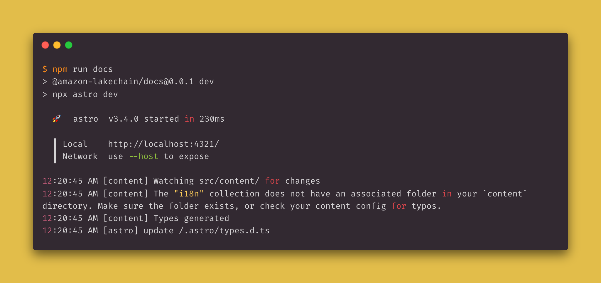
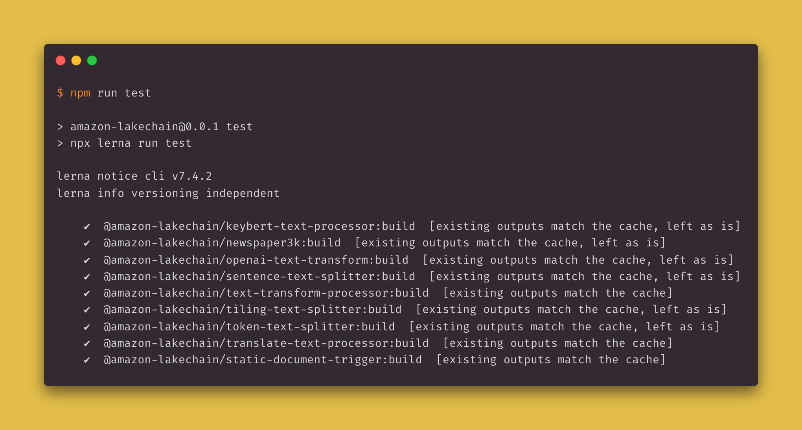
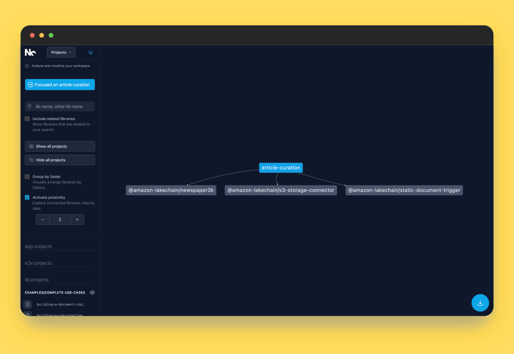

# 📦 Packages

This directory hosts all packages that are part of Project Lakechain, and is built on top of a monorepo architecture powered by [Lerna](https://lerna.js.org/) and [Nx](https://nx.dev/).
Lerna is a tool that helps optimize the development workflow around managing multi-package repositories within a single monorepo, while keeping the ability to act on and publish each package individually.

Below is an overview of the packages, how to build them, and how they are structured.

## Structure

The packages are organized under the following sections :

- [Core](./core) - The Lakechain Core package that provides the core integration of middlewares with AWS CDK, and the shared functionalities required to build middlewares.
- [Middlewares](./middlewares) - This directory contains a hierarchy of all pre-built middlewares made available by the Lakechain project, and organized by category.
- [Layers](./layers) - The layers package provides a set of AWS Lambda Layers commonly used by middlewares.
- [TypeScript SDK](./typescript-sdk) - The TypeScript SDK is a library providing the functionalities to easily build middleware's compute such as AWS Lambda functions, or ECS containers.
- [Constructs](./constructs) - The Lakechain construct library is a set of CDK constructs that are shared across middlewares and examples.
- [CLI](./cli/) - The Lakechain CLI is a command line interface that provides a set of commands to help developers bootstrap new middlewares, and manage their development workflow.
- [RAG CLI](./tools/rag-cli/) - The RAG CLI is a command line interface that allows you to ask questions to your documents stored in OpenSearch using a large language model powered by Amazon Bedrock.

## Build

To build all packages, simply run:

```bash
npm run build
```

<br />
<p align="left">
  
</p>
<br />

The [nx.json](../nx.json) file at the root of this repository defines the Nx configuration for the project, and it particular, the caching behavior. Thanks to Lerna and Nx, the packages artifacts are automatically locally cached, and only modified packages are rebuilt.

## Docs

You can generate and open the documentation for Project Lakechain by running:

```bash
npm run docs
```

<br />
<p align="left">
  
</p>

## Test

To run all unit-tests for all packages, run:

```bash
npm run test
```

<br />
<p align="left">
  
</p>

## Graph

Nx provides a very convenient tool to visualize the overall dependency structure of the packages in the repository. To generate and open the dependency graph, run:

```bash
npm run graph
```

<br />
<p align="left">
  
</p>

## Clean

To clean all packages, run:

```bash
npm run clean
```

This will remove all build artifacts and `node_modules` directories.

## Lint

To lint all packages, run:

```bash
npm run lint
```

## Scopes and Versioning

Every package in this repository is a publishable NPM package, scoped under `@project-lakechain/`. Every package follows [Semantic Versioning](https://semver.org/), and a fixed versioning strategy.

This means that each package is tied to the version of Lakechain. In other words, when Lakechain is updated, we publish a new version of all packages automatically. This allows us to ensure a consolidated versioning and release strategy across all packages.

> ⚠️ While Project Lakechain is in `alpha`, every package's major number will be set to `0`, and every package minor version change must be considered as a breaking change.
