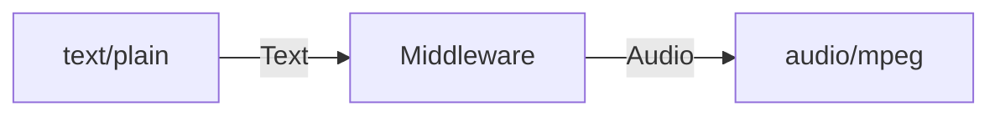
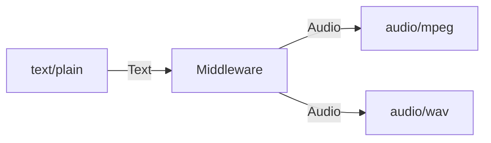
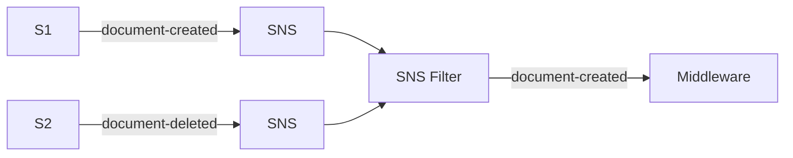
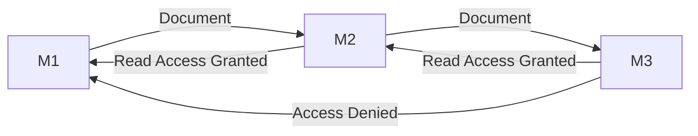

# :package: Lakechain Core

---

 

---

> [!Note]
> The Lakechain Core package is part of [Project Lakechain](https://github.com/awslabs/project-lakechain), an AI-powered document processing pipeline framework based on the AWS CDK.
> For more information on how to use this package, please refer to the [Project Documentation](https://awslabs.github.io/project-lakechain/).

## Overview

Lakechain Core allows developers to easily create new middlewares using Infrastructure as Code (IaC) on top of the AWS CDK. This package provides different primitives to create new middlewares:

- [**Middleware API**](./src/middleware.ts) - This is the base construct that should be extended by all middlewares. It provides all the functionalities to define and manage middlewares.
- [**Pipeline Visualization**](./src/visualization/) - A set of components allowing to render a pipeline from infrastructure code into vector graphics.
- [**Lakechain DSL**](./src/dsl/) - A domain specific functional language allowing to define conditions or intents.

## Installation

To use the Core package when creating your own middleware, simply add a reference to the `@project-lakechain/core` package in your `package.json`.

```bash
npm install --save @project-lakechain/core
```

## Implementation

To create your own middleware, you extend the `Middleware` abstract construct part of this package. This abstract class provides a ready-to-use framework for implementing CDK constructs that are ready to be integrated as part of the Lakechain ecosystem.

### Service Description

To define a new middleware, you start by defining a new `ServiceDescription` that defines at minimum the middleware name, its description, and its version.

```typescript
import { ServiceDescription } from '@project-lakechain/core';

/**
 * The service description.
 */
const description: ServiceDescription = {
  name: 'sample-middleware',
  description: 'A sample middleware.',
  version: '0.3.4',
  attrs: {}
};
```

### Middleware Builder

Middlewares follow the builder pattern to be constructed, and the `MiddlewareBuilder` class can be inherited by sub-implementations to provide your own set of parameters specific to your middleware.

```typescript
import { MiddlewareBuilder } from '@project-lakechain/core';

/**
 * The builder for the `SampleMiddleware` service.
 */
class SampleMiddlewareBuilder extends MiddlewareBuilder {
  /**
   * @returns a new instance of the `SampleMiddleware`
   * service constructed with the given parameters.
   */
  public build(): Middleware {
    return new SampleMiddleware(this.scope, this.identifier, {
      ...this.props
    });
  }
}
```

You can add custom properties to your middleware using a `Zod` schema, along with the setters allowing to mutate these properties. Below is an example defining a new property `foo` that can be passed to your middleware using the `.withFoo` method.

```typescript
import { z } from 'zod';
import { MiddlewareBuilder, MiddlewareProps } from '@project-lakechain/core';

/**
 * The sample middleware properties schema
 */
const PropsSchema = MiddlewareProps.extend({
  foo: z.number()
});

type Props = z.infer<typeof PropsSchema>;

/**
 * The builder for the `SampleMiddleware` service.
 */
class SampleMiddlewareBuilder extends MiddlewareBuilder {
  private middlewareProps: Props;

  /**
   * Sets the foo property.
   */
  public withFoo(foo: number) {
    this.foo = foo;
    return this;
  }

  /**
   * @returns a new instance of the `SampleMiddleware`
   * service constructed with the given parameters.
   */
  public build(): Middleware {
    return new SampleMiddleware(this.scope, this.identifier, {
      ...(this.middlewareProps as Props),
      ...this.props
    });
  }
}
```

You then define the middleware itself, with its own components. Below, is a simple middleware implementing a Lambda function consuming documents from the middleware's input queue. Both PDF and JSON documents are supported by this middleware as an input.

```typescript
import { Middleware, MiddlewareProps } from '@project-lakechain/core';

class DefaultTestMiddleware extends Middleware {
  public static Builder = SampleMiddlewareBuilder;

  constructor(
    scope: Construct,
    id: string,
    private opts: Props
  ) {
    super(scope, id, description, opts);

    // Validate the properties.
    this.opts = this.parse(AI21TextProcessorPropsSchema, props);

    // A lambda function processing documents.
    const lambda = // ...
      // Allows this construct to act as a `IGrantable`
      // for other middlewares to grant the processing
      // lambda permissions to access their resources.
      (this.grantPrincipal = lambda.grantPrincipal);

    // Plug the SQS queue into the lambda function.
    lambda.addEventSource(new sources.SqsEventSource(this.eventQueue));

    // Grant the lambda permissions to publish to the
    // SNS output topic.
    this.eventBus.grantPublish(lambda);

    // Call the `bind` method when done.
    super.bind();
  }

  /**
   * @returns an array of mime-types supported as input
   * type by this middleware.
   */
  supportedInputTypes(): string[] {
    return ['application/pdf', 'application/json'];
  }

  /**
   * @returns an array of mime-types supported as output
   * type by the data producer.
   */
  supportedOutputTypes(): string[] {
    return ['text/plain'];
  }

  /**
   * @returns the supported compute types by the
   * middleware.
   */
  supportedComputeTypes(): ComputeType[] {
    return [ComputeType.CPU];
  }

  /**
   * Allows a grantee to read from the processed documents
   * generated by this middleware.
   */
  grantReadProcessedDocuments(grantee: cdk.aws_iam.IGrantable): cdk.aws_iam.Grant {
    return {} as cdk.aws_iam.Grant;
  }
}
```

## Concepts

Every middleware have a set of properties that are true no matter the type of middleware being built.

### I/O Types

Every middleware declares a supported set of input types and output types. This means the type of document that a middleware supports as an input, and can produce as an output is known at deployment-time. The same way typed programming languages enforce types on inputs and outputs of functions or methods, Lakechain middlewares define what they can support. This way, if documents not supported by a middleware trigger a pipeline execution, that middleware will not even be triggered, thus reducing potential errors happening at runtime and unnecessary costs.

The way middlewares declare the document types they support is done by overriding the `Middleware` construct and leverage [Multipurpose Internet Mail Extensions (MIME)](https://en.wikipedia.org/wiki/MIME) types as the type of documents.

For example, to create a text-to-speech middleware converting text documents to audio transcripts, you would likely declare your middleware as:



If your middleware supports generating audio transcripts in multiple formats such as MP3, and WAV, you can of course declare multiple output types:



### Input Conditionals

By default, middlewares only receive documents that match their supported input types. In fact, if you try to connect two middlewares that don't have overlapping input and output types, an exception will be thrown by Lakechain at deployment time.

It is however interesting to dive deep into how Project Lakechain leverages SNS filtering mechanisms to allow middlewares to define conditionals beyond the type of documents they support.

When you deploy a middleware, an SNS filter is automatically created for your middleware at deployment time. This filter is applied on all SNS subscriptions binding the previous middlewares in the pipeline to your middleware.

To illustrate this behavior, let's assume your middleware receives documents from two other middlewares in the pipeline, `S1` and `S2`. Let's say that you are only interested in _document creation_ events, and you are not interested in _document deletion_ events. You can tell Lakechain to only send you documents that are _created_ by overriding the `conditional` method in your `Middleware` implementation and returning an explicit conditional expression:

```typescript
conditional() {
  return (super
    .conditional()
    .and(when('type').equals('document-created'))
  );
}
```

The above conditional will result in the following flow to be applied at runtime:



In this example, only document creation events are received by your middleware, and document deletion events are filtered out. This is very powerful as you have the freedom to create complex conditionals in your middleware based on fields in input events.

### Permission Model

In a Lakechain pipeline, a middleware only has read access to documents made available to it. A middleware will only be able to read documents from middlewares that are directly connected to it in a pipeline, and will not have access to documents provided by other middlewares not directly connected to its input.

This segregation of permissions not only makes a pipeline more secured and reduces its attack surface by isolating components, but also enforces a strong decoupling between each middleware.



This segregation is enforced using AWS IAM policies. To make Lakechain middlewares fully integrated in the AWS CDK permission model, each middleware implements the [`IGrantable`](https://docs.aws.amazon.com/cdk/v2/guide/permissions.html#permissions_grants) interface that makes it easy for developers to seamlessly grant access to a given middleware. This makes it possible for middlewares to easily control access grants when they are connected to other middlewares, and allows developers to grant additional permissions to a middleware.

```typescript
// Create an example middleware.
const myMiddleware = new MyMiddleware.Builder().withContext(this).withIdentifier('MyMiddleware').build();

// Create an example bucket.
const bucket = new s3.Bucket(this, 'Bucket');

// Grant the middleware access to the bucket.
bucket.grantRead(myMiddleware);
```

Similarly, it is also possible for a middleware to grant other constructs read access to its documents.

```typescript
// Create an example middleware.
const myMiddleware = new MyMiddleware.Builder()
  .withContext(this)
  .withIdentifier('MyMiddleware')
  .build();

// Create an external lambda function.
const lambda = new lambda.Function(this, 'Function', { ... });

// Grant the external lambda access to the middleware documents.
myMiddleware.grantReadProcessedDocuments(lambda);
```
