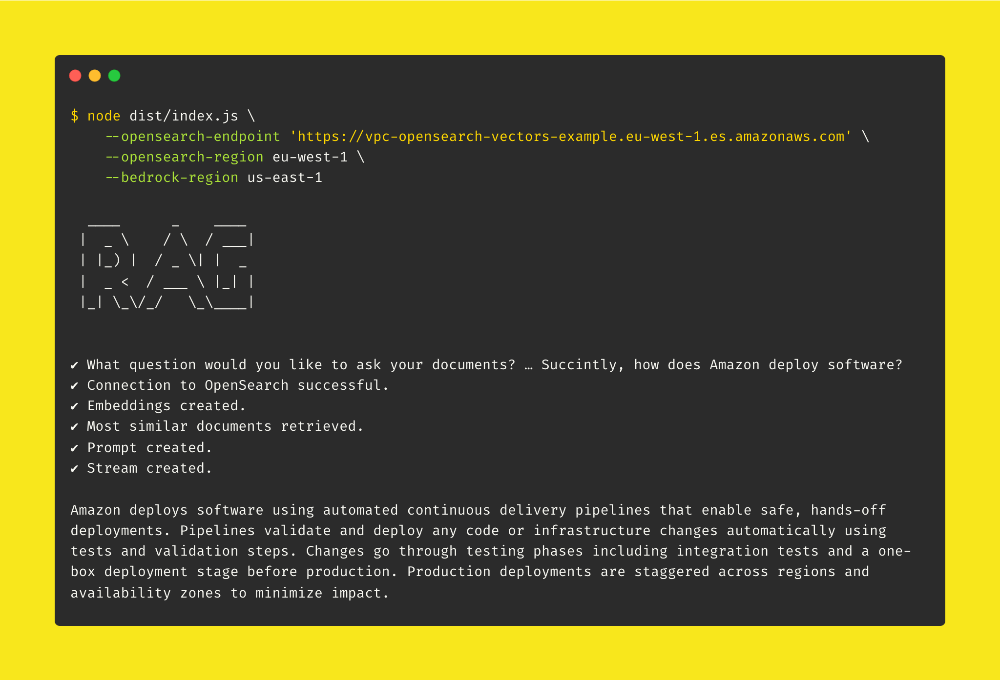

<br />
<p align="center">
  
</p>
<br />

## Overview

This command-line interface gives an example of how customers can implement Retrieval Augmented Generation (RAG) using the [RAG Pipeline](../../../examples/end-to-end-use-cases/building-a-rag-pipeline/) example.

While the pipeline itself processes documents, creates embeddings for each of their chunks, and stores those embeddings in Amazon OpenSearch, this CLI allows you to ask questions to your documents stored in OpenSearch using a large language model powered by Amazon Bedrock.

## Install

To use this tool, you first need to install its dependencies and build it.

```bash
npm install
```

> The result of the build will be located in the `dist/` directory.

## Access the VPC

Because OpenSearch is deployed in a VPC private subnet for security reasons, you will need to get access to the VPC to run this tool, as it will need to query your OpenSearch index. To do so, you have two options.

### Cloud9 or EC2

One option is to run this example on a [Cloud9](https://aws.amazon.com/cloud9/) or EC2 instance located, or having access to, the VPC in which OpenSearch has been deployed.

### Port Forwarding

Alternatively, you can use the [AWS Systems Manager Session Manager](https://docs.aws.amazon.com/systems-manager/latest/userguide/session-manager.html) to access the VPC from your local machine using port forwarding.

## Usage

Run the CLI by passing it with the required configuration.

> **Note**
> You can also omit any parameters and let the command-line tool prompt you for the missing information.

```bash
node dist/index.js \
  --opensearch-endpoint 'https://vpc-opensearch-vectors-example.eu-west-1.es.amazonaws.com' \
  --opensearch-region eu-west-1 \
  --bedrock-region us-east-1
```
