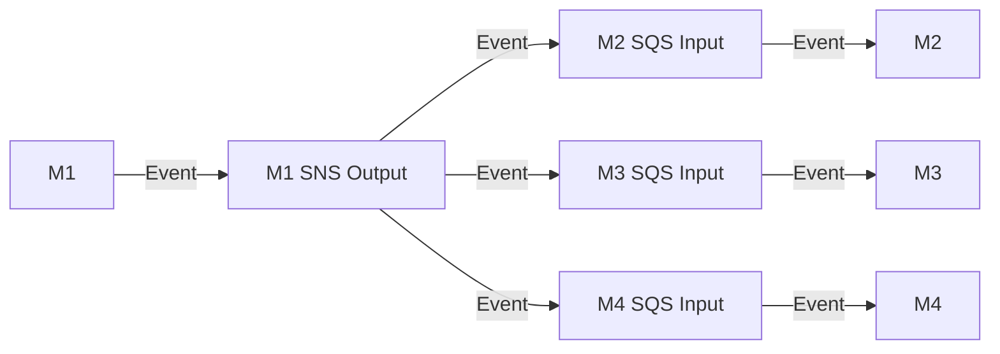

# :package: TypeScript SDK

---

 

---

> [!Warning]
> The TypeScript SDK package has an unstable API and should not be used in a production environment.
> It should be assumed that the API will undergo heavy changes in upcoming versions.

## Overview

The TypeScript SDK for [Project Lakechain](https://github.com/awslabs/project-lakechain) makes it easy for developers authoring their own middlewares to build resilient components that integrate smoothly within the Lakechain ecosystem. This SDK is compatible with TypeScript middlewares built around Lambda Functions or Docker containers.

The services and components provided by this SDK are:

- [**Model Definitions**](./src/models/) - This is the core of the SDK which provides the TypeScript definition, validators and serialization/de-serialization for events shared between middlewares. This is used by every TypeScript middleware to consume events, metadata and document data.
- [**Cache Storage**](./src/cache/) - Allows middlewares to store data in the cache storage that is shared across middlewares.
- [**Decorators**](./src/decorators/) - Provides decorators for TypeScript that can be used to publish the result of a middleware to the next middlewares in a pipeline.
- [**Helpers**](./src/helpers/) - Several helpers are also included that makes repetitive tasks easier to implement, such as converting between an S3 URL and a bucket/key pair, copying data from one S3 location to another, etc.
- [**AWS PowerTools Integration**](./src/powertools/) - This SDK is tightly integrated with the [AWS Lambda PowerTools](https://github.com/aws-powertools/powertools-lambda-typescript) project to provide a seamless experience for developers in building their middlewares and enabling features such as semi-structured logging, distributed tracing, etc.

---

## Installation

To use the TypeScript SDK in your middleware, simply add a reference to the `@project-lakechain/sdk` package in your `package.json`.

```bash
npm install --save @project-lakechain/sdk
```

---

## Usage

### Model Definitions

One of the key advantages of using this SDK is the abstraction it provides around the Lakechain data model which carries information from one middleware to the other.

Each Middleware has an input which consists of an SQS queue, and an output which consists of an SNS topic, allowing middlewares to fan-out their results to multiple middlewares in map operations.

<br>



<br>

The events exchanged between middlewares follow the same *language* for data interchange, and this SDK provides a simple, programmatic, access to that data.

The following example assumes you are receiving events in your middleware from an SQS queue, and you want to de-serialize the events into TypeScript objects within an AWS Lambda environment.

```typescript
import { CloudEvent } from '@project-lakechain/sdk';

/**
 * Your Lambda entry point.
 * @param event the received SQS event.
 */
const handler = (event: SQSEvent) => {
  const events = event.Records.map((r) => {
    return (CloudEvent.from(r.body));
  });
};
```

The above example recursively de-serializes the `CloudEvent` payloads associated with the received SQS records, and validates each one of them. If an error is identified, an exception is thrown during the de-serialization process.

---

### Accessing Documents

The most important element in a document processing pipeline is the document itself, and the TypeScript SDK  provides a way to easily retrieve the information about the source document and the currently processed document in the pipeline.

```typescript
/**
 * Handles a single Lakechain event.
 * @param event the received event.
 */
const handleEvent = (event: CloudEvent) => {
  // Reference the source document.
  const source = event.data().source();
  // Reference the currently processed document.
  const document = event.data().document();
};
```

You can also access the information exposed by the currently processed document.

```typescript
const handleEvent = (event: CloudEvent) => {
  const document = event.data().document();

  // Display information about the document.
  console.log(`URL:  ${document.url()}`);
  console.log(`Size: ${document.size()}`);
  console.log(`Type: ${document.mimeType()}`);
  console.log(`Size: ${document.size()}`);
  console.log(`Id:   ${document.id()}`);
};
```

---

### Loading Documents in Memory

The TypeScript SDK also provides primitives to load a document in memory, which is useful when you want to transform it, or extract information from it.
In the below example, we load a document entirely in memory as a buffer.

```typescript
const handleEvent = async (event: CloudEvent) => {
  const document = event.data().document();

  // Load the document raw data in memory as a buffer.
  const data = await document.data().asBuffer();

  // You can also load the data as an `ArrayBufferLike`.
  const arrayBuffer = await document.data().asArrayBuffer();
};
```

While loading a document entirely in memory might be convenient, and in some cases required when using third-party libraries which only work with in-memory buffers, it is not always the most efficient way to process documents. Especially when working with large documents in an environment as constrained as a small AWS Lambda or AWS Fargate container.

To address use-cases where it is possible to act on a document in streaming, and therefore not having to load that document entirely in memory, the SDK provides a read stream interface.

```typescript
const handleEvent = async (event: CloudEvent) => {
  const document = event.data().document();

  // Consume the document as a read stream.
  const stream = await document.data().asReadStream();
};
```

---

### Downloading to the Filesystem

> **Warning**
> Downloading documents on the filesystem is
> generally not recommended and considered an
> anti-pattern for performance, complexity and
> cost reasons.

There are some cases, although rare, that we came across where a middleware needs to use a third-party library that can only consume documents from the filesystem. Below is an example of how to achieve that.

```typescript
const handleEvent = async (event: CloudEvent) => {
  const document = event.data().document();

  // Download the document to a temporary location.
  const path = await document.data().asFile();

  // Download the document to a specific location.
  const path = await document.data().asFile('/tmp/file');
};
```

---

## Serialization and Cloning

A `CloudEvent` and its hierarchy of objects are natively serializable and de-serializable to and from JSON. They all implement the `toJSON` Javascript method, so they can be trivially serialized.

```typescript
const handleEvent = async (event: CloudEvent) => {
  const serialized = JSON.stringify(event);
};
```

You can also deep-clone a `CloudEvent` instance to create a new event with the same data. This is especially convenient for cases where your middleware is producing many documents from a single input document that will inherit most of the input document data.

```typescript
const handleEvent = async (event: CloudEvent) => {
  const cloned = event.clone();
};
```

---

## Modifying Documents

Transformative middlewares take documents as an input, apply transformations on them, and produce transformed documents as an output. Below is an example where we apply a very simple transformation on input text documents, and send them to the next middlewares by using the `next()` decorator.

```typescript
import { CloudEvent, Document } from '@project-lakechain/sdk/models';
import { next } from '@project-lakechain/sdk/decorators';

/**
 * Handles a single Lakechain event.
 * @param event the received Lakechain event.
 * @return a promise to the new event to forward to the
 * next middlewares.
 */
@next()
const handleEvent = async (event: CloudEvent) => {
  const data     = event.data();
  const document = data.document();

  // Load the document as a string.
  const data = (await document.data().asBuffer()).toString('utf-8');

  // Transform the text to upper case.
  const transformed = data.toUpperCase();

  // Upload the transformed document to the middleware storage.
  const transformedDocument = await upload(transformed);

  // Update the event with the new reference to the
  // transformed document.
  data.props.document = new Document.Builder()
    .withUrl(transformedDocument.url)
    .withSize(transformedDocument.size)
    .withEtag(transformedDocument.etag)
    .withType('text/plain')
    .build();
  
  return (event);
};
```

---

## Accessing Document Metadata

Every input document will carry a metadata object carrying additional information that are specific to the type of the document. Metadata allow middlewares and the consumers of a pipeline to take informed decision on how to process a document. For example, metadata for images might carry information about the dimensions of the image, while metadata for text documents might carry information about the language of the text.

> **Note**
> The information available in the metadata depend on the middlewares
> running before your middleware.
> As middlewares can enrich metadata throughout a pipeline execution, the
> metadata of a document are only as good as the middlewares that came
> before your middleware.

You can access the metadata of a document using the same `CloudEvent` API as before.

```typescript
const handleEvent = async (event: CloudEvent) => {
  const metadata = event.data().metadata();

  // Display general information about the document.
  console.log(`Authors:     ${metadata.authors()}`);
  console.log(`Title:       ${metadata.title()}`);
  console.log(`Description: ${metadata.description()}`);

  if (metadata.properties.kind === 'text') {
    console.log(`Language: ${metadata.properties.attrs.language}`);
  } else if (metadata.properties.kind === 'image') {
    console.log(`Dimensions: ${metadata.properties.attrs.width}x${metadata.properties.attrs.height}`);
  }
};
```

---

## Using Pointers

The TypeScript SDK provides a very convenient way to reference arbitrary resources using [Uniform Resource Identifier (URIs)](https://en.wikipedia.org/wiki/Uniform_Resource_Identifier) when those resources are too voluminous to be included in the event payload.

Let's assume you are building a middleware that extracts faces and their bounding boxes from images. You might want to *reference* those bounding boxes using a URI instead of *including* them as part of the `CloudEvent` payload shared with middlewares. This is because the event might become too large to be carried over message queues such as SQS, or event buses such as SNS.

To address this issue, the TypeScript SDK uses the concept of *typed-pointers* which allows to reference a remote resource while preserving its original type, and thus, being able to serialize and de-serialize it safely. If you look at the standard definition for document metadata, there are many which are pointers to remote resources such as NLP processing results, face recognition and object detection results, etc.

You can find below a simplistic example, where we create a typed pointer to a remote resource, and then de-reference it to access the original resource.

```typescript
import { Pointer } from '@project-lakechain/sdk/models';

class Todo {
  userId: number;
  id: number;
  title: string;
  completed: boolean;
}

// Create our pointer to a URI.
const pointer = new PointerBuilder<Todo>()
  .withUri('https://jsonplaceholder.typicode.com/todos/1')
  .withClassType(Todo)
  .build();

// Dereference the pointer into a `Todo`.
const todo: Todo = await pointer.resolve();
```

It works with arrays, too.

```typescript
// Note that we're pointing to /todos.
const pointer = new PointerBuilder<Array<Todo>>()
  .withUri('https://jsonplaceholder.typicode.com/todos')
  .withClassType(Todo)
  .build();

// Resolve the array.
const todos: Array<Todo> = await pointer.resolve();
```

Now back to our use-case of building a document processing pipeline, let's see how this can be applied to middlewares.

The below example takes a realistic case where your middleware is performing object detection on images, and you want to reference the bounding boxes of the detected objects in the document metadata.

```typescript
import { CloudEvent } from '@project-lakechain/sdk/models';
import { next } from '@project-lakechain/sdk/decorators';
import { CacheStorage } from '@project-lakechain/sdk/cache';

@next()
const handleEvent = async (event: CloudEvent) => {
  const document = event.data().document();
  const metadata = event.data().metadata();

  // Load the image in memory.
  const image = await document.data().asBuffer();

  // Extract the list of faces.
  const faces = await extractFaces(image);

  // Put the faces into the cache storage.
  const pointer = new CacheStorage().put('faces', faces);

  // Set the pointer in the document metadata.
  metadata.properties.attrs.faces = pointer;
  
  return (event);
};
```

---

## Helpers Library

The SDK provides a set of helpers that are often convenient when building a new middleware and having to interact with different services. In this section we will list the different APIs you can use to streamline your development.

### Describing an S3 Object

Middleware developers often use S3 as a storage service to store documents, because of its excellent performance at very low cost. The SDK makes use of [Uniform Resource Identifier (URIs)](https://en.wikipedia.org/wiki/Uniform_Resource_Identifier) to identify resources, including resources located on S3.

Because it is important for developers of middlewares to be able to translate between S3 URI notations and the S3 bucket/key pair notation, the SDK provides the `S3ObjectDescriptor` API to do just that in an encoding-safe way.

```typescript
import { S3ObjectDescriptor } from '@project-lakechain/sdk/helpers';

// Convert between an S3 URI and a bucket/key pair.
const descriptor = S3ObjectDescriptor.fromUri('s3://my-bucket/my-key');

// Display the bucket/key pair.
console.log(`Bucket: ${descriptor.bucket()}`);
console.log(`Key:    ${descriptor.key()}`);
```

It is also possible to create a descriptor by providing it with a bucket and a key, and convert it back into an S3 URI.

```typescript
import { S3ObjectDescriptor } from '@project-lakechain/sdk/helpers';

// Create a descriptor from a bucket/key pair.
const descriptor = new S3ObjectDescriptor.Builder()
  .withBucket('my-bucket')
  .withKey('my-key')
  .build();

// Display the S3 URI.
console.log(`URI: ${descriptor.asUri()}`);
```

---

### Copying from S3-to-S3

In certain circumstances, you might need to copy data from one bucket to another. To do so, the SDK provides a helper that will copy an object source to its destination in streaming, meaning that the entire object will not be entirely loaded in memory, making it possible to copy large objects.

> **Note**
> The use of copies in any high-throughput computing system is generally
> discouraged for its high cost and low performance implications.
> We recommend using other options such as passing an object by reference
> (its URI) or using pre-signed URLs when possible.
> We are providing this API for convenience in cases where it is not possible
> to use other options.

```typescript
import { S3StreamCopier } from '@project-lakechain/sdk/helpers';

// Copy an object from one bucket to another.
const copier = new S3StreamCopier.Builder()
  .withSource('s3://source-bucket/source-object')
  .withDestination('s3://destination-bucket/destination-object')
  .build();

// Start the copy operation.
await copier.copy();
```
